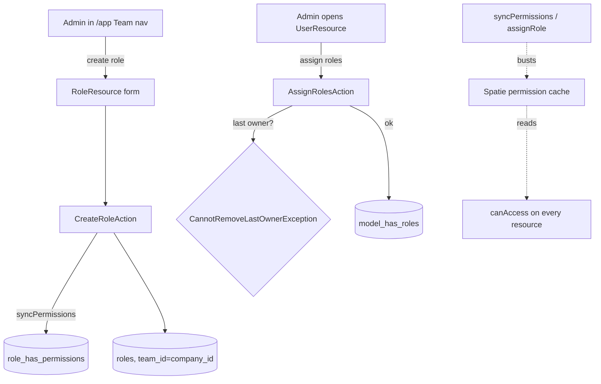

# RBAC — Architecture

Simple-ops pattern: three Actions (`lorisleiva/laravel-actions`) over the Spatie permission tables. No service layer — Filament resources call the Actions directly.

## Actions (`app/Actions/`)

| Action | Signature | Notes |
|---|---|---|
| `CreateRoleAction` | `run(CreateRoleData): Role` | creates role under the current company team, syncs permissions |
| `AssignRolesAction` | `run(AssignRolesData): void` | throws `CannotRemoveLastOwnerException` |
| `DeleteRoleAction` | `run(string $roleId): void` | throws `CannotDeleteBuiltInRoleException`; refuses while users assigned *(assumed)* |

## Exceptions (`app/Exceptions/`)

- `CannotRemoveLastOwnerException` — guards demotion/removal of the final `owner`.
- `CannotDeleteBuiltInRoleException` — guards deletion of `owner`/`admin`/`manager`/`employee`.

## Filament surface

- `RoleResource` — shield-generated permission matrix grouped by domain.
- `UserResource` — list users, assign roles, deactivate; invite action (soft-dep on invitations).

## Role / permission flow

## Related

- [[_module]] · [[data-model]] · [[api]] · [[security]]
- [[../../../architecture/patterns/policy]] · [[../../../architecture/caching]]
