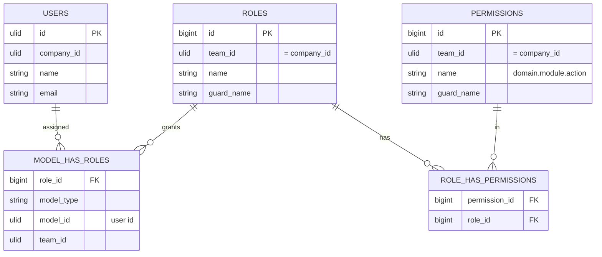

# RBAC — Data Model

No custom tables. Uses the four `spatie/laravel-permission` tables, all scoped by `team_id = company_id`.

| Table | Purpose |
|---|---|
| `permissions` | all permission strings, scoped by `team_id` |
| `roles` | named roles per company team |
| `model_has_roles` | user → role assignments (polymorphic `model_type`/`model_id`) |
| `role_has_permissions` | role → permission assignments |

## ERD

## Related

- [[_module]] · [[security]] · [[../../../architecture/caching]]
