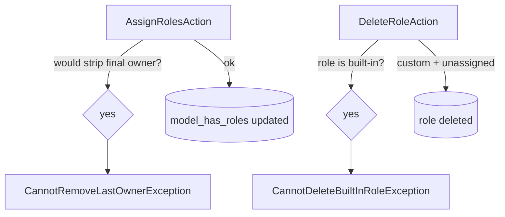

# RBAC — Last-Owner & Built-in Role Guardrails

Parent: [[../_module]]

Two exception classes (`app/Exceptions/`) protect the integrity of a company's ownership and its built-in roles.

## CannotRemoveLastOwnerException

Thrown by `AssignRolesAction` when a role change would leave the company with **zero** users holding `owner`. Covers both explicit demotion (removing `owner` from a user's role set) and any reassignment that strips the final owner. A company can therefore never lock itself out of full administrative control.

## CannotDeleteBuiltInRoleException

Thrown by `DeleteRoleAction` when the target is one of `owner`, `admin`, `manager`, `employee`. The four built-in roles are permanent scaffolding — custom roles ([[custom-roles]]) are deletable, built-ins are not.

`DeleteRoleAction` also refuses deletion while users are still assigned to the role *(assumed)*.

## Guard flow

## UI

- **Kind**: background (server-side guardrails) surfaced as inline blocks on the RBAC screens.
- **Page**: no dedicated page — enforced in `AssignRolesAction` / `DeleteRoleAction`; surfaced on
  `RoleResource` + `UserResource` (`/app/roles`, `/app/users`) as disabled actions + explanatory notices.
- **Key interactions**: attempting to demote the sole owner, assign a second owner, or delete a built-in
  role → blocked with a clear message (owner change routes to [[ownership|transfer]] instead).
- **States**: default (guardrail invisible) · error (blocked action → `CannotRemoveLastOwnerException` /
  `CannotDeleteBuiltInRoleException` message).
- **Gating**: applies within `core.rbac.*` surfaces.

## Data

- Reads/writes: Spatie role assignments (own tables) only. No cross-domain writes ([[../../../../security/data-ownership]]).

## Relations

- Consumes: nothing. Feeds: nothing cross-domain — the guardrails are internal invariants of RBAC.

## Related

- [[../_module]] · [[../architecture]] · [[../security]]
- [[custom-roles]] · [[ownership]] · [[module-scoped-permissions]]
