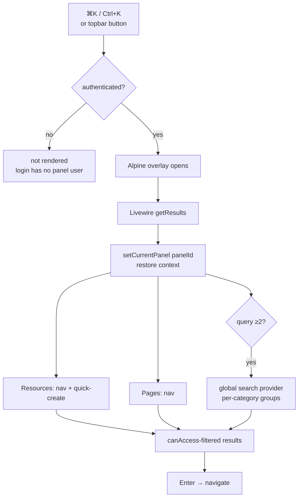

# Spotlight — Architecture

Parent: [[_module]]

A single Livewire component driven by an Alpine overlay, injected into every authenticated panel via two render hooks.

## Component

`app/Livewire/Spotlight.php` — namespace `App\Livewire`, `class Spotlight extends Livewire\Component`.

- Props: `public string $panelId`, `public string $query`.
- `mount(string $panelId)`.
- Computed `getResultsProperty(): array` returns grouped results.

### Panel-context restore (pitfall)

Livewire update requests **don't run panel routing**, so `Filament::getCurrentPanel()` is null mid-request. The computed re-establishes context first:

```php
Filament::setCurrentPanel(Filament::getPanel($this->panelId));
```

This is the null-panel pitfall — see [[../../../architecture/patterns/filament-panel-chrome]].

## Three result sources (all `canAccess()`-filtered)

| Source | Group(s) | Cap |
|---|---|---|
| Panel **Resources** | "Navigation" (Go to list) + "Quick actions" (New &lt;Model&gt;, when `hasPage('create') && canCreate()`) | nav 8 / quick 5 |
| Panel **Pages** | "Navigation" (Go to page) | (within nav 8) |
| Panel **global search provider** (query ≥2) | one group per category — `$panel->getGlobalSearchProvider()->getResults()`, each result = title + details + url | 6 / category |

## Render hooks (`app/Providers/AppServiceProvider.php`)

Both via `FilamentView::registerRenderHook(...)`:

- **`PanelsRenderHook::BODY_END`** — renders `@livewire('spotlight', ['panelId' => Filament::getCurrentPanel()?->getId()])`, but **only when `Filament::auth()->check()`** (login pages have no panel user).
- **`PanelsRenderHook::GLOBAL_SEARCH_BEFORE`** — a 320px "Search this panel…" topbar button with a ⌘K `kbd` hint that dispatches the `ff-spotlight-open` custom event.

## Blade / Alpine

`resources/views/livewire/spotlight.blade.php` — Alpine `x-data` overlay teleported to `<body>`. Opens on `keydown.window.meta.k` / `.ctrl.k` and the `ff-spotlight-open` event; ESC closes; up/down move through `.ff-spotlight-result`; Enter clicks the active one. CSS classes `ff-spotlight-overlay` / `ff-spotlight`. Detail: [[features/keyboard-palette]].

## Filament Artifacts

**Nav group:** (none — chrome overlay injected via render hooks, not a nav entry)

| Artifact | Kind ([[../../../architecture/ui-strategy]] row) | Blueprint / Tweaks | Notes |
|---|---|---|---|
| `Spotlight` (Livewire overlay) | Render-hook chrome component *(assumed — no dedicated ui-strategy row; closest analogue is #10 notification bell, render hook)* | [[../../../architecture/patterns/filament-panel-chrome]] | `BODY_END` palette (authenticated only) + `GLOBAL_SEARCH_BEFORE` topbar trigger; restores panel context per null-panel pitfall |

**Access contract (mandatory):** Spotlight is not a Filament resource or routed page — it is a render-hook chrome overlay, so it states its gate explicitly: the `BODY_END` hook renders **only when `Filament::auth()->check()`**, and every result is `canAccess()`-filtered against the *current panel's* Resources / Pages / global-search provider (which honour per-record authorization + `CompanyScope`). `core.spotlight` is platform chrome (always active) — there is no `hasModule()` gate and no dedicated permission string; the palette can never link to something the user's own `canAccess()` would deny. See [[security]] and [[../../../architecture/filament-patterns]] #1.

## Concurrency

| Write path | Tier | Mechanism |
|---|---|---|
| (none) | n/a | Spotlight is a stateless read-only navigation/search overlay — it owns no tables and performs no writes, so there is no concurrent-edit surface |

Tiers per [[../../../decisions/decision-2026-07-02-optimistic-locking-standard]].

## Flow



## Related

- [[_module]] · [[security]] · [[features/keyboard-palette]]
- [[../../../architecture/filament-patterns]] · [[../../../architecture/patterns/filament-panel-chrome]]
