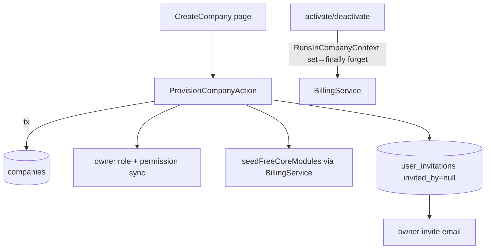

# Staff Console — Architecture

Parent: [[_module]] · See [[features/company-provisioning]]

`/admin`-panel Filament surface over existing models. No new domain services — it drives [[../billing-engine/_module]]'s `BillingService` and a single provisioning action.

## Filament Artifacts

**Nav group:** Companies · Billing · Monitoring (all `/admin`, admin-guard)

| Artifact | Kind ([[../../../architecture/ui-strategy]] row) | Blueprint / Tweaks | Notes |
|---|---|---|---|
| `CompanyResource` (+ List/Create/Edit) | #1 CRUD resource | tweaks: view-page-tabs (Modules / Invoices / Users relation managers), custom-header-actions (suspend-with-reason), inline-relation-repeater (n/a) | cross-company list (admin has no `CompanyContext` → `CompanyScope` no-ops); `CreateCompany` drives `ProvisionCompanyAction` ([[features/company-provisioning]]) |
| `ModulesRelationManager` | #1 CRUD resource (relation table) | tweaks: custom-header-actions (activate / deactivate — free-core deactivation refused) | mutations run through `BillingService` inside `RunsInCompanyContext` ([[features/module-management]]) |
| `InvoicesRelationManager` | #1 CRUD resource (relation table) | tweaks: read-only-flow-owned (billing owns writes) | per-company invoices ([[features/billing-overview]]) |
| `UsersRelationManager` | #1 CRUD resource (relation table) | tweaks: read-only-flow-owned | per-company user directory |
| `BillingInvoiceResource` (+ `ListBillingInvoices`) | #1 CRUD resource | tweaks: read-only-flow-owned (`canCreate(): false`; billing-engine owns writes) | cross-company invoices, status filters ([[features/billing-overview]]) |
| `AdminResource` (+ List/Create/Edit) | #1 CRUD resource | tweaks: custom-header-actions (self / last-admin delete guard) | manages FlowFlex-staff admin accounts |
| `UserResource` (+ `ListUsers`) | #1 CRUD resource | tweaks: read-only-flow-owned | cross-company user directory |
| `ActivityResource` (+ `ListActivities`) | #1 CRUD resource | tweaks: read-only-flow-owned | cross-company audit trail |
| `PlatformStatsWidget` | #6 Dashboard widget | [[../../../architecture/patterns/page-blueprints#Dashboard]] | companies-by-status, revenue this month, open/past-due, MRR estimate ([[features/platform-dashboard]]) |
| `RevenueChartWidget` | #6 Dashboard widget | [[../../../architecture/patterns/page-blueprints#Dashboard]] | 12-month revenue chart (apexcharts) |
| `SystemHealthWidget` | #6 Dashboard widget | [[../../../architecture/patterns/page-blueprints#Dashboard]] | over spatie/laravel-health |
| `AdminLogin` page | Admin-guard login page *(assumed — not a standard ui-strategy row)* | — | `/admin` auth entry (admin guard) |
| Horizon + Pulse nav links (Monitoring group) | External links (not Filament pages) | — | staff-gated (`viewPulse` gate = staff/local) |

**Access contract (mandatory):** `/admin` is a FlowFlex-**staff** panel behind the **admin guard** — it has no spatie teams. Every artifact (resources, relation managers, widgets, and the custom `AdminLogin` page) gates on:
`canAccess() = auth('admin')->check()`
per [[../../../architecture/filament-patterns]] #1. `core.staff-console` is a platform staff module (always active) — there is **no** `BillingService::hasModule()` gate and no tenant permission string; cross-tenant visibility is intentional and reachable only by staff. In prod the panel is additionally IP-allowlisted (see [[security]]). Custom pages/widgets state this gate explicitly — Filament does not auto-gate them.

## Concurrency

| Write path | Tier | Mechanism |
|---|---|---|
| Company edit (locale / timezone / currency / trial) | Optimistic | `updated_at` stale-check on `EditCompany` save → `StaleRecordException` → conflict notification ([[../../../architecture/patterns/optimistic-locking]]) |
| Admin CRUD (`AdminResource`) | Optimistic | `updated_at` stale-check; self / last-admin delete guard ([[../../../architecture/patterns/optimistic-locking]]) |
| Company provisioning (`ProvisionCompanyAction`) | n/a | Atomic insert transaction; unique slug + owner-email constraints prevent duplicate provisioning — a create flow with no concurrent-edit surface |
| Module activate / deactivate & company suspend | n/a (delegated) | Mutations delegate to `BillingService` inside a set-then-forgotten `CompanyContext`; the subscription / suspension concurrency tier is owned by [[../billing-engine/architecture|core.billing]] |
| Invoice / user / activity reads | n/a | Read-only cross-company surfaces — no write path |

Tiers per [[../../../decisions/decision-2026-07-02-optimistic-locking-standard]].

## Company-context handling — `RunsInCompanyContext`

Admin requests carry **no** CompanyContext, so `CompanyScope` no-ops and cross-company reads work natively. But mutating `BillingService` calls (`activateModule` / `deactivateModule`) require a context. The `RunsInCompanyContext` concern sets the context per call and forgets it in a `finally`, preventing leakage into subsequent admin queries.

## Action

`ProvisionCompanyAction` (lorisleiva) — single transaction: create company (unique slug) → owner role + full permission sync (team = company) → `seedFreeCoreModules` → owner `UserInvitation` + mail. Context set + forgotten internally.

