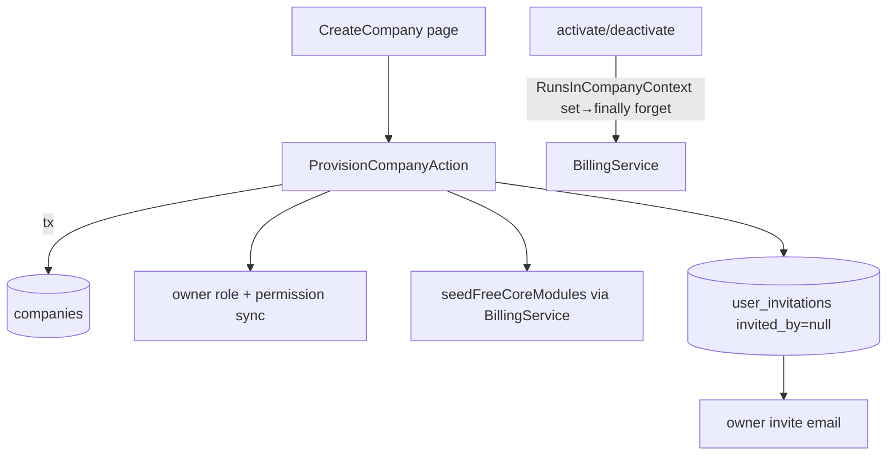

# Staff Console — Architecture

Parent: [[_module]] · See [[features/company-provisioning]]

`/admin`-panel Filament surface over existing models. No new domain services — it drives [[../billing-engine/_module]]'s `BillingService` and a single provisioning action.

## Filament artifacts

| Artifact | Kind (ui-strategy) |
|---|---|
| `CompanyResource` (+ List/Create/Edit) | Standard CRUD (#1) |
| `CompanyResource` relation managers: `ModulesRelationManager`, `InvoicesRelationManager`, `UsersRelationManager` | Relation tables (#1) |
| `BillingInvoiceResource` (+ `ListBillingInvoices`) | Read-only resource table (#1) |
| `AdminResource` (+ List/Create/Edit) | Standard CRUD; self / last-admin delete guard (#1) |
| `UserResource` (+ `ListUsers`) | Cross-company directory, read-only (#1) |
| `ActivityResource` (+ `ListActivities`) | Cross-company audit trail, read-only (#1) |
| `PlatformStatsWidget` | Stats overview widget (#9) |
| `RevenueChartWidget` | Chart widget (#9) |
| `SystemHealthWidget` | Custom widget over spatie/laravel-health (#9) |
| `AdminLogin` page | admin-guard login |
| Horizon + Pulse nav links (Monitoring group, staff-gated) | External links |

## Company-context handling — `RunsInCompanyContext`

Admin requests carry **no** CompanyContext, so `CompanyScope` no-ops and cross-company reads work natively. But mutating `BillingService` calls (`activateModule` / `deactivateModule`) require a context. The `RunsInCompanyContext` concern sets the context per call and forgets it in a `finally`, preventing leakage into subsequent admin queries.

## Action

`ProvisionCompanyAction` (lorisleiva) — single transaction: create company (unique slug) → owner role + full permission sync (team = company) → `seedFreeCoreModules` → owner `UserInvitation` + mail. Context set + forgotten internally.

