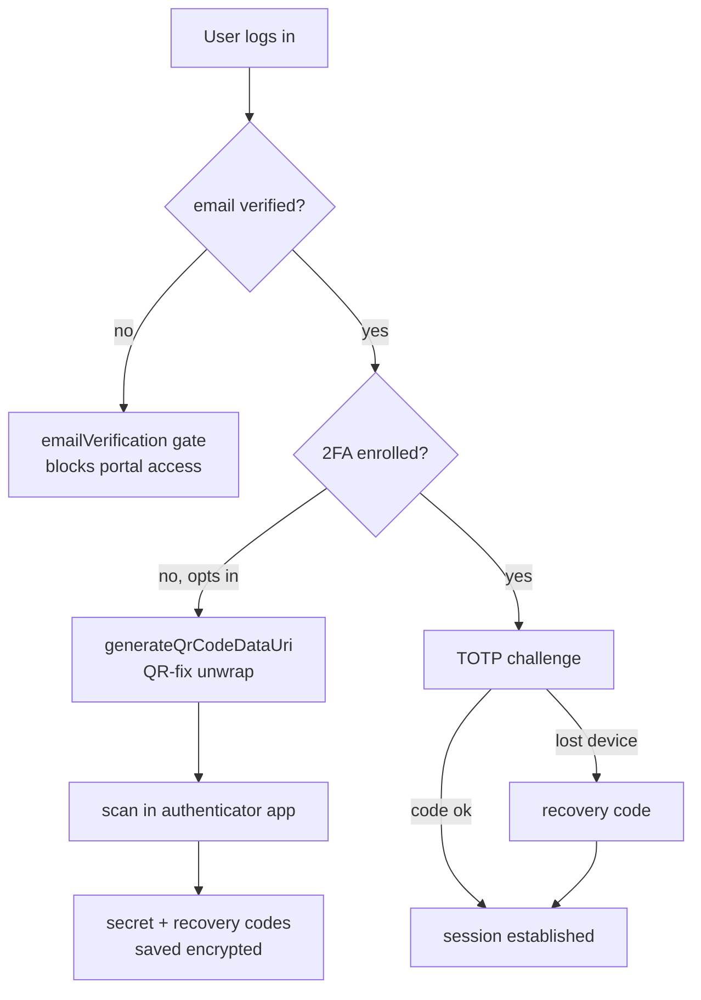

# Two-Factor Auth — Architecture

Parent: [[_module]]

2FA is Filament's built-in multi-factor feature, registered per panel with one custom subclass to fix QR rendering.

## Panel-provider wiring

Both providers register the same pair, email verification first:

```php
->emailVerification()          // "no portal access without verified email"
->multiFactorAuthentication(
    AppAuthentication::make()->recoverable(),
)
```

- `AppPanelProvider` (line ~49) — `/app`, web users.
- `AdminPanelProvider` (line ~43) — `/admin`, staff/admins.
- `->recoverable()` enables recovery codes alongside the TOTP factor.
- In both providers `AppAuthentication` is an **alias** for the custom subclass (`use App\Support\Filament\AppAuthenticationWithQrFix as AppAuthentication`).

## The QR-fix subclass

`app/Support/Filament/AppAuthenticationWithQrFix.php` — namespace `App\Support\Filament`, `class AppAuthenticationWithQrFix extends Filament\Auth\MultiFactor\App\AppAuthentication`. It overrides one method:

```php
protected function generateQrCodeDataUri(string $secret): string
```

**The bug it fixes:** google2fa's `getQRCodeInline()` (bacon SVG backend) already returns a complete `data:image/svg+xml;base64,…` URI. Filament's imagick-less fallback then wraps that URI in base64 a **second** time, so the browser renders an empty image. The override detects the double-wrap and unwraps once, yielding a valid data URI. Detail: [[features/qr-code-fix]].

## Enrollment / challenge flow



## Related

- [[_module]] · [[data-model]] · [[security]] · [[features/qr-code-fix]]
- [[../../../architecture/filament-patterns]]
