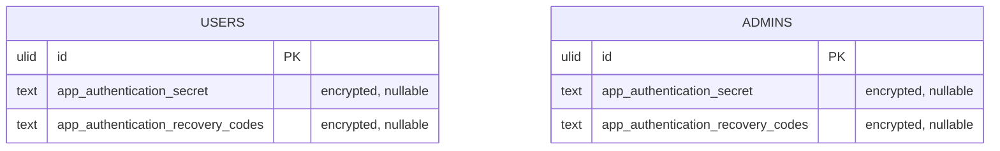

# Two-Factor Auth — Data Model

Parent: [[_module]]

No new tables — two migrations add columns to the existing `users` and `admins` tables. Both secret and recovery codes are **encrypted `text`** columns (per [[../../../security/encryption]]; migration comment: "Encrypted casts — text, never string").

## Migrations

| Migration | Table |
|---|---|
| `2026_06_11_180000_add_two_factor_columns_to_users_table.php` | `users` |
| `2026_06_11_220000_add_two_factor_columns_to_admins_table.php` | `admins` |

## Columns added (both tables)

| Column | Type | Cast | Notes |
|---|---|---|---|
| `app_authentication_secret` | text, nullable | `encrypted` | TOTP shared secret |
| `app_authentication_recovery_codes` | text, nullable | `encrypted` | recovery-code set |

> [!warning] UNVERIFIED — needs confirmation: a `two_factor_enabled` boolean column. The admins-table migration's `down()` drops `two_factor_enabled`, implying users/admins may also carry that boolean, but it was not seen in an `up()`. Marked `*(assumed)*`. See [[unknowns]].

## ERD

## Related

- [[_module]] · [[security]] · [[../../../security/encryption]]
