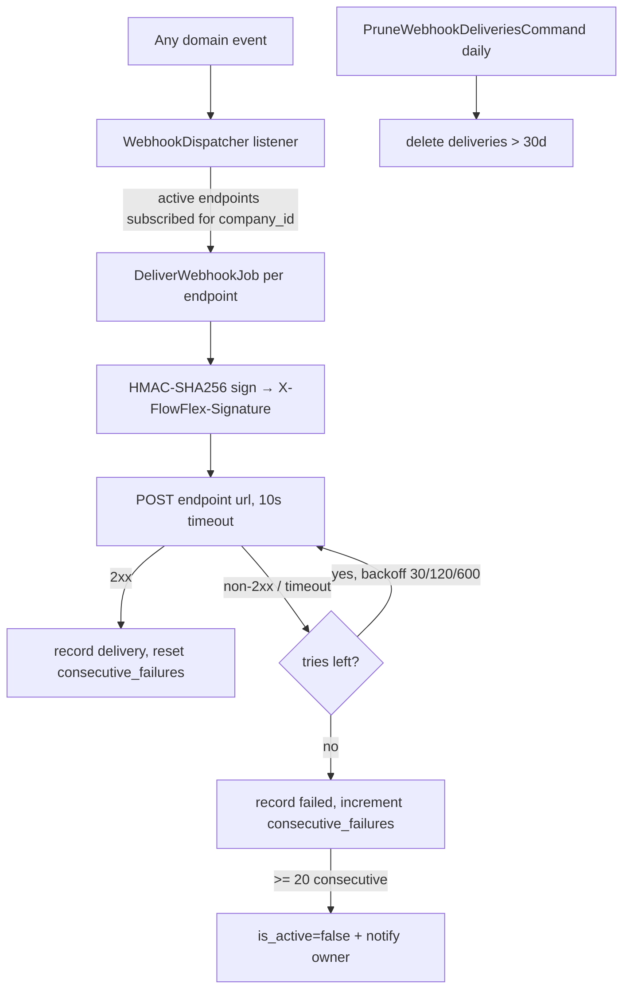

# Webhooks — Architecture

Parent: [[_module]] · See also [[api]] · [[data-model]]

## Dispatcher

`WebhookDispatcher` — a universal queued listener registered for every event in the [[../../../architecture/event-bus]] map. On any event it finds the active endpoints for that `company_id` subscribed to the event type, and dispatches one `DeliverWebhookJob` per endpoint.

## Delivery job

`DeliverWebhookJob` — `webhooks` queue, `tries = 4`, `backoff = [30, 120, 600]` seconds. It:

1. signs the payload (`X-FlowFlex-Signature` = HMAC-SHA256 of payload + secret),
2. POSTs (10s timeout),
3. records a `webhook_deliveries` row,
4. increments `consecutive_failures` on non-2xx / resets it on success.

Auto-disables the endpoint after 20 consecutive failures *(assumed)* and notifies the owner.

## Actions

- `SendTestWebhookAction::run(string $endpointId): WebhookDelivery` — sends a test payload; rate-limited (a few sends per endpoint per minute, see [[security]]).
- `RotateWebhookSecretAction::run(string $endpointId): string` — returns a new plain secret once, re-encrypts at rest.

## Jobs & Scheduling

| Job / Command | Queue | Schedule | Idempotency |
|---|---|---|---|
| `DeliverWebhookJob` | webhooks | on event | delivery row per (endpoint, event instance); consumer-side dedupe via payload `id` *(assumed)* |
| `PruneWebhookDeliveriesCommand` | default | daily | date-guard delete (deliveries pruned after 30 days *(assumed)*) |

## Filament Artifacts

**Nav group:** Settings *(assumed)*

| Artifact | Kind ([[../../../architecture/ui-strategy]] row) | Blueprint / Tweaks | Notes |
|---|---|---|---|
| `WebhookEndpointResource` (+ List/Create/Edit) | #1 CRUD resource | tweaks: state-badge-column (active/auto-disabled), custom-header-actions (send-test, rotate-secret), inline-relation-repeater (domain-grouped event checkboxes) | HTTPS-validated URL; create-once secret reveal; only active-module events subscribable |
| Deliveries relation manager | #1 CRUD resource (relation table) | tweaks: read-only-flow-owned (`DeliverWebhookJob` owns writes) | per-endpoint delivery log — timestamp, event type, response status, retry count ([[features/delivery-log]]) |

**Access contract (mandatory):** every artifact gates on
`canAccess() = Auth::user()->can('core.webhooks.view-any') && BillingService::hasModule('core.webhooks')`
per [[../../../architecture/filament-patterns]] #1. Non-CRUD header actions carry their own permission (`core.webhooks.test`, `core.webhooks.rotate`) and a named rate limiter — `SendTestWebhookAction` calls an external URL (SSRF/spam guard) and `RotateWebhookSecretAction` mints a secret, so both name the `panel-action` limiter (see [[security]]). Deliveries themselves are outbound HTTP POSTs to external URLs, not Filament artifacts.

## Concurrency

| Write path | Tier | Mechanism |
|---|---|---|
| Endpoint CRUD (form, API) | Optimistic | `updated_at` stale-check on save → `StaleRecordException` → conflict notification ([[../../../architecture/patterns/optimistic-locking]]) |
| Secret rotation (`RotateWebhookSecretAction`) | Pessimistic | `DB::transaction()` + `lockForUpdate()` on the endpoint row: re-read, issue new secret, re-encrypt at rest atomically — prevents a double-rotate race ([[../../../architecture/patterns/states]]) |
| Delivery failure counter + auto-disable | Pessimistic | `lockForUpdate()` on the endpoint when updating `consecutive_failures` and evaluating the 20-failure auto-disable threshold, so concurrent deliveries don't race the disable ([[../../../architecture/patterns/states]]) |
| Delivery-log insert (`webhook_deliveries`) | n/a | Append-only — one row per (endpoint, event instance); no concurrent-edit surface |

Tiers per [[../../../decisions/decision-2026-07-02-optimistic-locking-standard]].

## Flow

