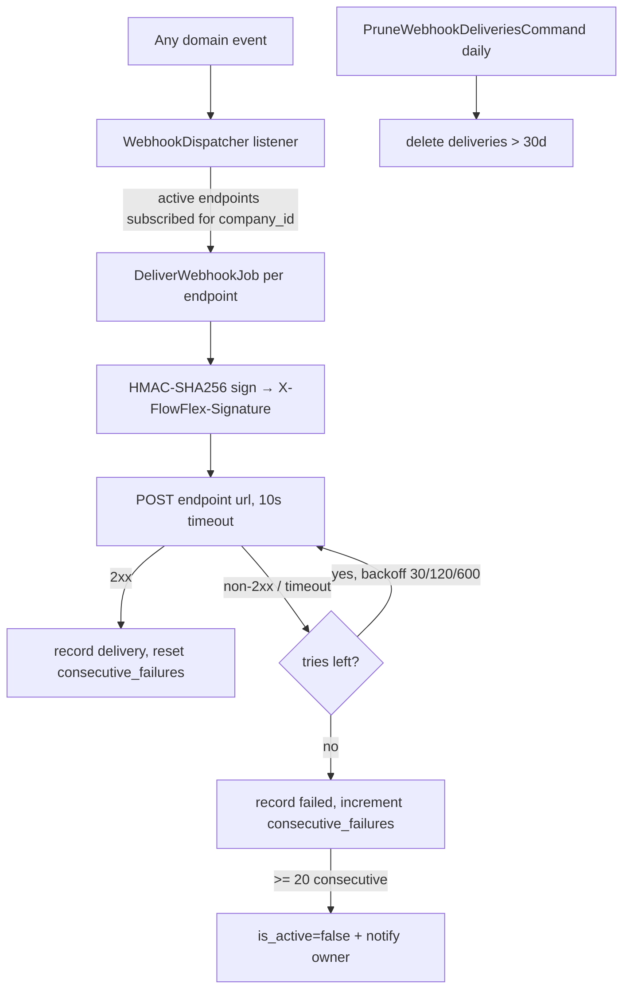

# Webhooks — Architecture

Parent: [[_module]] · See also [[api]] · [[data-model]]

## Dispatcher

`WebhookDispatcher` — a universal queued listener registered for every event in the [[../../../architecture/event-bus]] map. On any event it finds the active endpoints for that `company_id` subscribed to the event type, and dispatches one `DeliverWebhookJob` per endpoint.

## Delivery job

`DeliverWebhookJob` — `webhooks` queue, `tries = 4`, `backoff = [30, 120, 600]` seconds. It:

1. signs the payload (`X-FlowFlex-Signature` = HMAC-SHA256 of payload + secret),
2. POSTs (10s timeout),
3. records a `webhook_deliveries` row,
4. increments `consecutive_failures` on non-2xx / resets it on success.

Auto-disables the endpoint after 20 consecutive failures *(assumed)* and notifies the owner.

## Actions

- `SendTestWebhookAction::run(string $endpointId): WebhookDelivery` — sends a test payload; rate-limited (a few sends per endpoint per minute, see [[security]]).
- `RotateWebhookSecretAction::run(string $endpointId): string` — returns a new plain secret once, re-encrypts at rest.

## Jobs & Scheduling

| Job / Command | Queue | Schedule | Idempotency |
|---|---|---|---|
| `DeliverWebhookJob` | webhooks | on event | delivery row per (endpoint, event instance); consumer-side dedupe via payload `id` *(assumed)* |
| `PruneWebhookDeliveriesCommand` | default | daily | date-guard delete (deliveries pruned after 30 days *(assumed)*) |

## Flow

