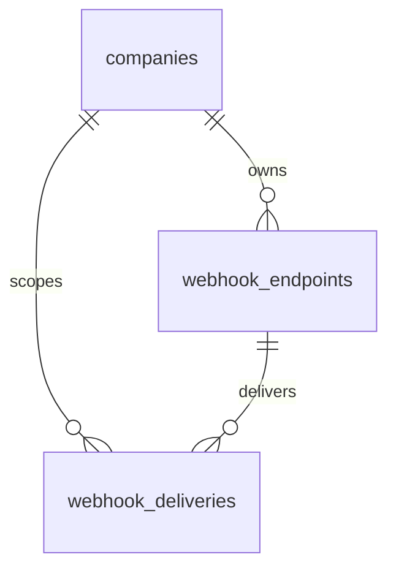

# Webhooks — Data Model

Parent: [[_module]] · See also [[architecture]] · [[security]]

Owns two tables: `webhook_endpoints` (with an encrypted `secret`) and `webhook_deliveries`.

## webhook_endpoints

| Column | Type | Constraints | Notes |
|---|---|---|---|
| id | ulid | PK | |
| company_id | ulid | not null, indexed | |
| url | string | not null, https only *(assumed)* | |
| 🔐 secret | text | not null | **encrypted cast**; shown once at creation |
| events | jsonb | not null | event class names |
| is_active | boolean | default true | |
| consecutive_failures | int | default 0 | auto-disable counter |
| deleted_at | timestamp | nullable | |

## webhook_deliveries

| Column | Type | Notes |
|---|---|---|
| id | ulid | PK |
| endpoint_id | ulid | FK webhook_endpoints |
| company_id | ulid | indexed `(company_id, delivered_at)` |
| event_type | string | |
| payload | jsonb | as sent |
| response_status | int | nullable — null = no response |
| attempts | int | |
| delivered_at | timestamp | nullable — success time |
| created_at | timestamp | |

Deliveries pruned after 30 days *(assumed)*.

