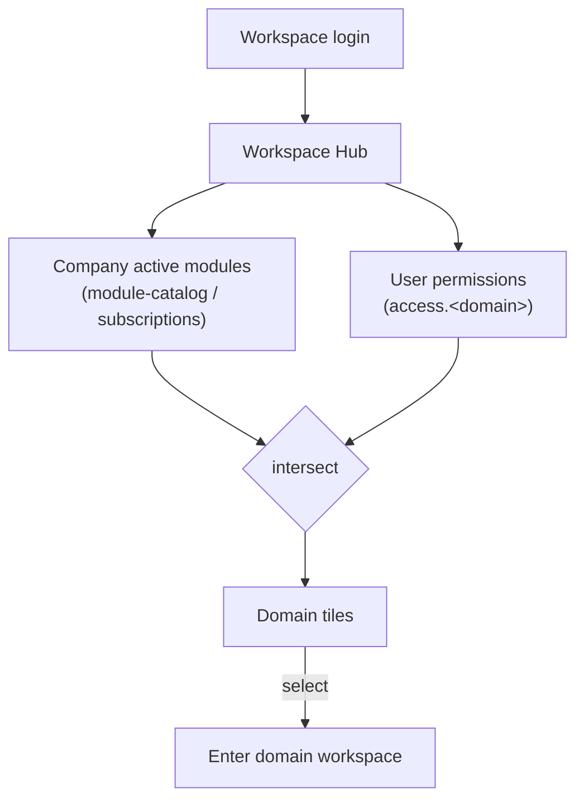

# Workspace Hub — Architecture

The hub is a **custom page** ([[../../../architecture/patterns/custom-pages]]) served as the tenant's
default post-login route. It renders a tile grid computed from *activated modules ∩ user permissions*.

## Domain list computation

- **Source of activation**: `company_module_subscription` rows / `ModuleCatalog` ([[../../../infrastructure/module-catalog]]).
- **Source of access**: Spatie permissions per domain (e.g. `access.hr`) resolved under the current
  company team ([[../../../security/tenancy-isolation]]).
- A domain groups its modules; a tile shows if **any** of the domain's modules is active and the user may enter.

## Routing target — open question

Two viable shapes (decide at build — [[unknowns]]):
1. **Single tenant panel** (`/app`) hosting the hub as home + each domain as a section/page group.
2. **Multi-panel**: hub links out to per-domain Filament panels (`/hr`, `/finance`, …) as in the earlier design.

The hub abstraction works either way; it is the launcher/router.

## Related

- [[_module]] · [[security]] · [[features/domain-launcher]] · [[../module-marketplace/_module]]
