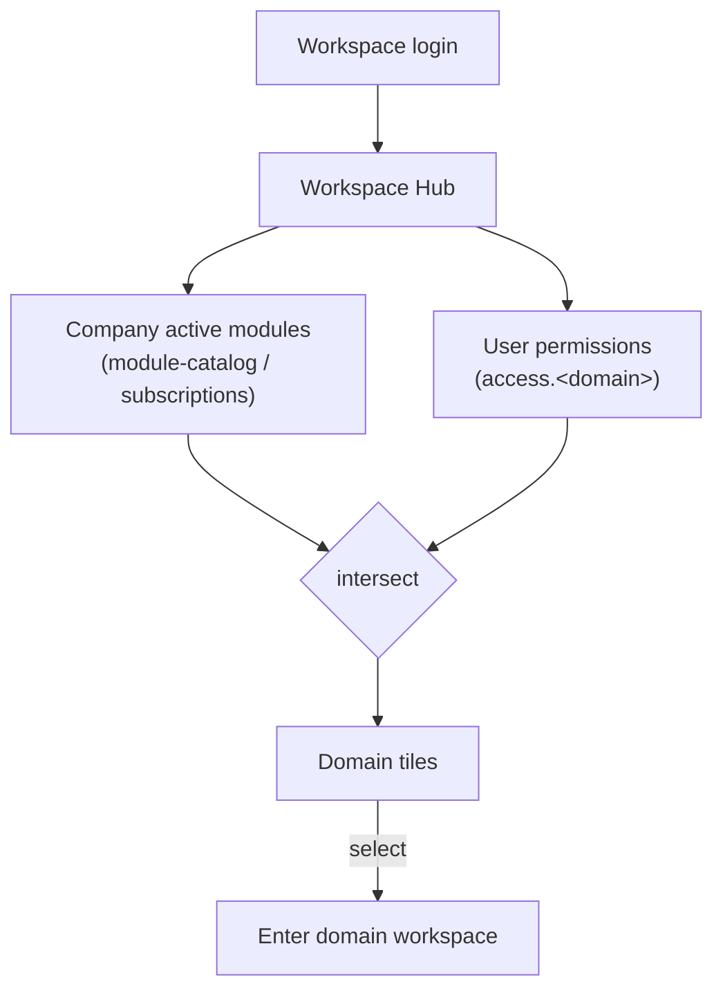

# Workspace Hub — Architecture

The hub is a **custom page** ([[../../../architecture/patterns/custom-pages]]) served as the tenant's
default post-login route. It renders a tile grid computed from *activated modules ∩ user permissions*.

## Domain list computation

- **Source of activation**: `company_module_subscription` rows / `ModuleCatalog` ([[../../../infrastructure/module-catalog]]).
- **Source of access**: Spatie permissions per domain (e.g. `access.hr`) resolved under the current
  company team ([[../../../security/tenancy-isolation]]).
- A domain groups its modules; a tile shows if **any** of the domain's modules is active and the user may enter.

## Routing target — open question

Two viable shapes (decide at build — [[unknowns]]):
1. **Single tenant panel** (`/app`) hosting the hub as home + each domain as a section/page group.
2. **Multi-panel**: hub links out to per-domain Filament panels (`/hr`, `/finance`, …) as in the earlier design.

The hub abstraction works either way; it is the launcher/router.

## Filament Artifacts

**Nav group:** (none — the hub is the tenant's default post-login landing route, not a nav entry)

| Artifact | Kind ([[../../../architecture/ui-strategy]] row) | Blueprint / Tweaks | Notes |
|---|---|---|---|
| `workspace-switcher` sidebar modal (chrome, no page) | n/a — panel chrome, not a screen (ADR [[../../../decisions/decision-2026-07-04-hub-modal-not-page\|hub-modal-not-page]]) | trigger pinned above nav via `SIDEBAR_NAV_START`; modal rows = activated modules ∩ user access permissions via `App\Support\Services\WorkspacePanels`; current workspace always listed + marked CURRENT; hover borders per row | replaced `WorkspaceHubPage` 2026-07-04 |

**Access contract (mandatory):** `WorkspaceHubPage` is a custom page and MUST state its gate explicitly — Filament does not auto-gate custom pages:
`canAccess() = Auth::user()->can('core.hub.view')` on the **web** guard only (admin/staff never reach the hub — they land on the staff console)
per [[../../../architecture/filament-patterns]] #1. `core.hub` is a platform module (always active) — no `BillingService::hasModule('core.hub')` gate; instead each **tile** is filtered by activation ∩ the domain's `access.<domain>` permission, and each domain's own routes stay guarded independently (defence in depth — the hub is a launcher, not the gate). See [[security]].

## Concurrency

| Write path | Tier | Mechanism |
|---|---|---|
| (none) | n/a | Workspace Hub owns no tables and performs no writes — a read-only launcher composing *activation ∩ permission* per request; there is no concurrent-edit surface |

Tiers per [[../../../decisions/decision-2026-07-02-optimistic-locking-standard]].

## Related

- [[_module]] · [[security]] · [[features/domain-launcher]] · [[../module-marketplace/_module]]
