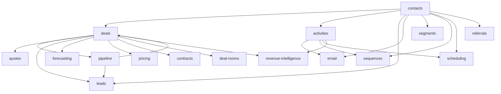

# CRM & Sales

Full customer relationship lifecycle: leads, contacts, deal pipeline, quoting, contracting, activities, email integration, and sales intelligence. **Panel:** `/crm` (Rose). Milestone M4 in [[_archive/ROADMAP]].

> [!warning] Domain planned for rebuild
> The CRM code was **stripped back to the app/admin shell** — none of these modules are currently built. Every module below is `build-status: planned`. Any "shipped / complete / live" language surviving in older notes reflects the pre-strip codebase and is being softened to intended tense during the rebuild. See [[decisions/decision-2026-06-19-strip-to-app-admin-shell]] for the strip decision, and [[decisions/decision-2026-06-12-custom-pipelines]] for the pipeline design that predates the strip.

**This panel also hosts the Customer Success domain** (see [[build/decisions/decision-2026-06-01-panel-consolidation]]). CS operates on CRM accounts, so sales + success share one customer panel. CS modules are Phase 3 — not v1.

**Displaces**: HubSpot CRM, Salesforce, Pipedrive, Close, Gainsight (CS)

---

## Navigation Groups

- **Pipeline** — Deals, Pipeline Board, Forecasting, Quotes, Contracts
- **Contacts** — Leads, Contacts, Companies (Accounts), Segments
- **Activities** — Activities, Email Integration, Sequences, Appointment Scheduling, Deal Rooms
- **Intelligence** — Revenue Intelligence, Referral Program
- **Settings** — Price Management
- **Customer Success** (Customer Success domain, P3) — Health Scores, Churn Risk, Playbooks, NPS, QBRs

---

## Modules

All 16 modules are rebuilt as folder specs (`<slug>/_module.md` + architecture / data-model / security / api / decisions / unknowns / features). Status is uniform `planned` post-strip.

| Module | Key | Priority | Build status | Depends on (intra-domain) | Kind highlights |
|---|---|---|---|---|---|
| [[domains/crm/contacts/_module\|Contacts]] | `crm.contacts` | v1-core | planned | — (anchor) | 2 resources + tabbed view page (#2), lifecycle state-badge + merge |
| [[domains/crm/deals/_module\|Deals]] | `crm.deals` | v1-core | planned | contacts, pipeline | CRUD resource (#1) + state-badge close/reopen header actions; board in crm.pipeline |
| [[domains/crm/pipeline/_module\|Pipeline Board]] | `crm.pipeline` | v1-core | planned | deals | Reverb Kanban board custom-page (#3), delegates stage move to crm.deals |
| [[domains/crm/activities/_module\|Activities]] | `crm.activities` | v1-core | planned | contacts | resource + activity-timeline view (#2) + overdue widget (#6) |
| [[domains/crm/quotes/_module\|Quotes]] | `crm.quotes` | v1-core | planned | deals | CRUD + pdf-preview view page + public Vue accept/decline (#16 token) |
| [[domains/crm/leads/_module\|Leads]] | `crm.leads` | v1 | planned | contacts, deals, pipeline (soft) | CRUD resource + gated convert-to-deal action |
| [[domains/crm/email-integration/_module\|Email Integration]] | `crm.email` | v1 | planned | contacts, activities | OAuth mailbox resource + embedded email thread + guest tracking/OAuth endpoints |
| [[domains/crm/customer-segments/_module\|Customer Segments]] | `crm.segments` | v1 | planned | contacts | CRUD resource + inline rule-tree builder + live audience preview |
| [[domains/crm/sales-sequences/_module\|Sales Sequences]] | `crm.sequences` | v1 | planned | contacts, activities | 2 CRUD resources (step builder + enrolment lifecycle) + background advance job |
| [[domains/crm/forecasting/_module\|Forecasting]] | `crm.forecasting` | v1 | planned | deals | Dashboard custom-page (#6) + quota CRUD; read-derived over deals |
| [[domains/crm/appointment-scheduling/_module\|Appointment Scheduling]] | `crm.scheduling` | v1 | planned | contacts, activities | 2 resources + availability page (#7) + public-booking Vue (#16) |
| [[domains/crm/price-management/_module\|Price Management]] | `crm.pricing` | v1 | planned | deals | catalogue/price-book CRUD (inline-repeater) + CPQ read-resolve service |
| [[domains/crm/contracts/_module\|Contracts]] | `crm.contracts` | v1 | planned | deals | resource (state-badge + pdf-preview) + renewals Kanban queue (#3) + renewal widget (#6) |
| [[domains/crm/deal-rooms/_module\|Deal Rooms]] | `crm.deal-rooms` | v1 | planned | deals | internal CRUD room + external tokenised Vue portal (#16 signed token) |
| [[domains/crm/revenue-intelligence/_module\|Revenue Intelligence]] | `crm.revenue-intelligence` | v1 | planned | deals, activities | read-only health resource + win/loss report page (#9) + Dashboard (#6); all derived |
| [[domains/crm/referral-program/_module\|Referral Program]] | `crm.referrals` | v1 | planned | contacts | 2 CRUD resources + leaderboard report page (#9) |

> [!note] Leads is UNVERIFIED
> `crm.leads` was rebuilt from the weakest spec in the vault (~2.9KB flat, missing a Dependencies table + DTOs, prose data model, self-declared assumed copy). It needs a full v2 spec pass before serving as a build blueprint — see [[domains/crm/leads/unknowns|leads/unknowns]].

Build order: contacts → deals → pipeline → activities → quotes → rest ([[_archive/BUILD-ORDER]]).

## Dependency Graph (intra-domain)



(deals ↔ pipeline: pipeline owns the stages table deals reference; the board builds after deals. Leads' inbound edges are soft — it degrades to a standalone capture list without deals/pipeline.)

## Cross-Domain Edges

| Direction | Event | Counterpart |
|---|---|---|
| Fires | `DealWon`, `DealLost` (deals) | finance.invoicing stub, crm.sequences |
| Consumes | `QuoteAccepted` — none (within-domain direct call) | |
| Consumes | `DealWon`, `InvoicePaid` (finance) | crm.sequences (success + upsell), contacts LTV |
| Consumes | `FormSubmissionReceived` (marketing P3), `EventRegistrationReceived` (events P3) | contacts find-or-create |

Payload contracts: [[architecture/event-bus]].

---

## Status Board (Dataview)

```dataview
TABLE module AS "Module", build-status AS "Build", status AS "Status"
FROM "domains/crm"
WHERE type = "module"
SORT module ASC
```

---

## Absorbed Domains

**Pricing Management** (formerly standalone) — price books and CPQ live in [[domains/crm/price-management/_module|price-management]].

---

## Key Patterns

- `spatie/laravel-model-states` — deal status, quote status, contract status
- `lorisleiva/laravel-actions` — `ConvertLeadAction`, `MoveDealToStage`, `MarkActivityComplete`
- Pipeline board = custom Filament page with Reverb broadcast ([[architecture/ui-strategy]] row #3)
- Leads are a distinct top-of-funnel object (`crm_leads`) that convert into deals; contacts also carry `lifecycle_stage` (see contacts + leads specs)
- Custom fields on contacts/accounts via [[architecture/patterns/custom-fields]]
