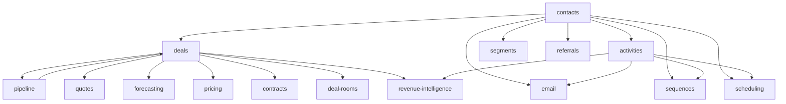

# CRM & Sales

Full customer relationship lifecycle: contacts, deal pipeline, quoting, contracting, activities, email integration, and sales intelligence. **Panel:** `/crm` (Rose). Milestone M4 in [[build/ROADMAP]].

**This panel also hosts the Customer Success domain** (see [[build/decisions/decision-2026-06-01-panel-consolidation]]). CS operates on CRM accounts, so sales + success share one customer panel. CS modules are Phase 3 — not v1.

**Displaces**: HubSpot CRM, Salesforce, Pipedrive, Close, Gainsight (CS)

---

## Navigation Groups

- **Pipeline** — Deals, Pipeline Board, Forecasting, Quotes, Contracts
- **Contacts** — Contacts, Companies (Accounts), Segments
- **Activities** — Activities, Email Integration, Sequences, Appointment Scheduling, Deal Rooms
- **Intelligence** — Revenue Intelligence, Referral Program
- **Settings** — Price Management
- **Customer Success** (Customer Success domain, P3) — Health Scores, Churn Risk, Playbooks, NPS, QBRs

---

## Modules

| Module | Key | Status | Priority | Depends on (intra-domain) |
|---|---|---|---|---|
| [[domains/crm/contacts\|Contacts]] | `crm.contacts` | planned | v1-core | — (anchor) |
| [[domains/crm/deals\|Deals]] | `crm.deals` | planned | v1-core | contacts, pipeline |
| [[domains/crm/pipeline\|Pipeline Board]] | `crm.pipeline` | planned | v1-core | deals |
| [[domains/crm/activities\|Activities]] | `crm.activities` | planned | v1-core | contacts |
| [[domains/crm/quotes\|Quotes]] | `crm.quotes` | planned | v1-core | deals |
| [[domains/crm/email-integration\|Email Integration]] | `crm.email` | planned | v1 | contacts, activities |
| [[domains/crm/customer-segments\|Customer Segments]] | `crm.segments` | planned | v1 | contacts |
| [[domains/crm/sales-sequences\|Sales Sequences]] | `crm.sequences` | planned | v1 | contacts, activities |
| [[domains/crm/forecasting\|Forecasting]] | `crm.forecasting` | planned | v1 | deals |
| [[domains/crm/appointment-scheduling\|Appointment Scheduling]] | `crm.scheduling` | planned | v1 | contacts, activities |
| [[domains/crm/price-management\|Price Management]] | `crm.pricing` | planned | v1 | deals |
| [[domains/crm/contracts\|Contracts]] | `crm.contracts` | planned | v1 | deals |
| [[domains/crm/deal-rooms\|Deal Rooms]] | `crm.deal-rooms` | planned | v1 | deals |
| [[domains/crm/revenue-intelligence\|Revenue Intelligence]] | `crm.revenue-intelligence` | planned | v1 | deals, activities |
| [[domains/crm/referral-program\|Referral Program]] | `crm.referrals` | planned | v1 | contacts |

Build order: contacts → deals → pipeline → activities → quotes → rest ([[build/BUILD-ORDER]]).

## Dependency Graph (intra-domain)



(deals ↔ pipeline: pipeline owns the stages table deals reference; the board builds after deals.)

## Cross-Domain Edges

| Direction | Event | Counterpart |
|---|---|---|
| Fires | `DealWon`, `DealLost` (deals) | finance.invoicing stub, crm.sequences |
| Consumes | `QuoteAccepted` — none (within-domain direct call) | |
| Consumes | `InvoicePaid` (finance) | contacts LTV, sequences upsell |
| Consumes | `FormSubmissionReceived` (marketing P3), `EventRegistrationReceived` (events P3) | contacts find-or-create |

Payload contracts: [[architecture/event-bus]].

---

## Status Board (Dataview)

```dataview
TABLE module-key AS "Key", status AS "Status", priority AS "Priority"
FROM "domains/crm"
WHERE type = "module"
SORT priority ASC, module-key ASC
```

---

## Absorbed Domains

**Pricing Management** (formerly standalone) — price books and CPQ live in [[domains/crm/price-management]].

---

## Key Patterns

- `spatie/laravel-model-states` — deal status, quote status, contract status
- `lorisleiva/laravel-actions` — `MoveDealToStage`, `MarkActivityComplete`
- Pipeline board = custom Filament page with Reverb broadcast ([[architecture/ui-strategy]] row #3)
- No separate Lead model — `crm_contacts.lifecycle_stage` (see contacts spec)
- Custom fields on contacts/accounts via [[architecture/patterns/custom-fields]]
