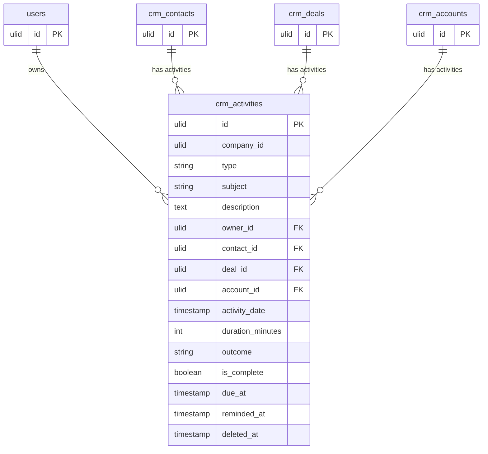

# Activities — Data Model

Tables owned: `crm_activities`.

---

## crm_activities

| Column | Type | Constraints | Notes |
|---|---|---|---|
| id, company_id (indexed) | ulid | | |
| type | string | not null | call / email / meeting / task / note |
| subject | string | not null | |
| description | text | nullable | |
| owner_id | ulid | not null FK users | |
| contact_id / deal_id / account_id | ulid | nullable FKs — at least one required | |
| activity_date | timestamp | not null | when it happened/happens |
| duration_minutes | int | nullable | |
| outcome | string | nullable | |
| is_complete | boolean | default true (false for tasks) | |
| due_at | timestamp | nullable | tasks only |
| reminded_at | timestamp | nullable | reminder-once guard |
| deleted_at | timestamp | nullable | |

**Indexes:**
- `(company_id, contact_id, activity_date)` — contact timeline
- `(company_id, deal_id, activity_date)` — deal timeline
- `(company_id, owner_id, is_complete, due_at)` — overdue queries

---

## ERD

---

## DTOs

### LogActivityData

| Field | Type | Validation |
|---|---|---|
| type | string | required, in:call,email,meeting,task,note |
| subject | string | required, max:255 |
| description | ?string | max:5000 |
| contact_id / deal_id / account_id | ?string | each ulid in company |
| activity_date | CarbonImmutable | required |
| duration_minutes | ?int | min:1 |
| due_at | ?CarbonImmutable | required_if type=task ("Tasks need a due date.") |

Cross-field rule: at least one of contact_id/deal_id/account_id required ("Link the activity to a contact, deal, or account.").

### ActivityData (output)
- Mirrors all columns; includes computed `is_overdue` flag.
