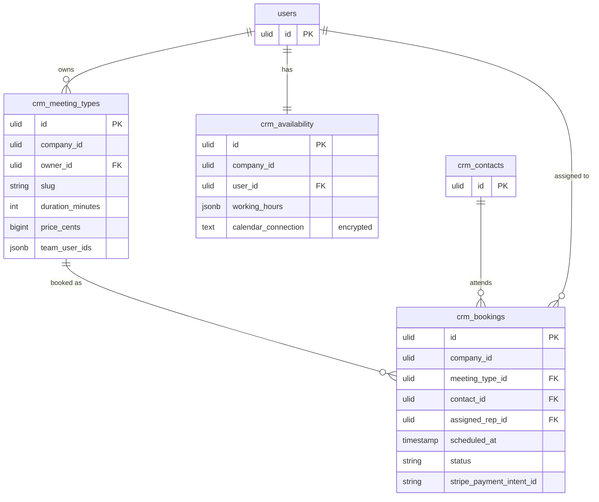

# Appointment Scheduling — Data Model

Owns `crm_meeting_types`, `crm_bookings`, and `crm_availability`.

## crm_meeting_types

| Column | Type | Notes |
|---|---|---|
| id | ulid | PK |
| company_id | ulid | Indexed, tenant scope |
| owner_id | FK users | Null = team round-robin *(assumed)* |
| name | string | |
| slug | string | Booking URL; unique per company |
| duration_minutes | int | |
| location_type | string | video / phone / in-person |
| video_link | string nullable | Static link v1 |
| buffer_minutes | int | Default 0 |
| price_cents | bigint | Default 0 (0 = free) |
| team_user_ids | jsonb nullable | Round-robin pool |
| deleted_at | timestamp nullable | Soft delete |

**Indexes:** `company_id`; unique `(company_id, slug)`.

## crm_bookings

| Column | Type | Notes |
|---|---|---|
| id | ulid | PK |
| company_id | ulid | Indexed, tenant scope |
| meeting_type_id | FK | |
| contact_id | FK | Find-or-created |
| assigned_rep_id | FK users | Round-robin result |
| scheduled_at | timestamp | No double-booking per rep (service check) |
| status | string | Default `confirmed`; confirmed / cancelled / completed / no-show |
| stripe_payment_intent_id | string nullable | Paid bookings |
| reminded_at | timestamp nullable | Reminder guard |

**Indexes:** `company_id`; `(assigned_rep_id, scheduled_at)` for slot-collision checks.

## crm_availability

| Column | Type | Notes |
|---|---|---|
| id | ulid | PK |
| company_id | ulid | Indexed, tenant scope |
| user_id | FK users | Unique |
| working_hours | jsonb | Per weekday `[{start,end}]` |
| calendar_connection | text nullable | 🔐 Encrypted OAuth blob (v1.x) |

**Indexes:** `company_id`; unique `user_id`.

## ER Diagram

