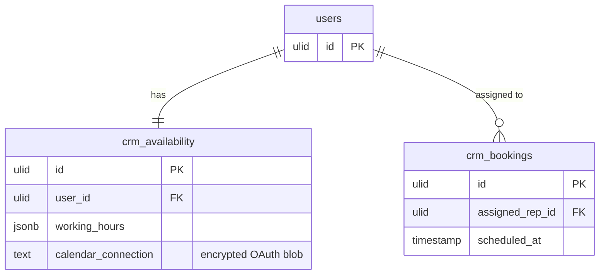

# Feature — Calendar Sync

> Deferred to v1.x *(assumed — OAuth scope creep)*. v1 ships working-hours-only availability; the encrypted `calendar_connection` column exists but is unused until this lands.

## Purpose

Two-way sync between a rep's FlowFlex availability and their Google/Outlook calendar, so external busy times block slots and new bookings push into the external calendar.

## Flow (planned v1.x)

1. Rep connects a Google/Outlook account via OAuth; the token blob is stored in `crm_availability.calendar_connection` (encrypted, `text` column — see [[../security]]).
2. `SchedulingService::slots()` subtracts external busy times, in addition to working hours, buffers, and existing bookings.
3. A confirmed booking is pushed to the external calendar with the same `.ics` details.
4. Token refresh runs on a schedule; connection errors surface on `AvailabilityPage`.

## Rules

- `calendar_connection` is always encrypted at rest ([[../../../security/encryption]]).
- OAuth consent and token handling isolated from the public booking guard.
- Absence of a connection degrades gracefully to working-hours-only (v1 behavior).

## Data Touched

- Owns / writes: `crm_availability` (incl. encrypted `calendar_connection`), `crm_bookings`
- Reads: rep/user identity (foundation); external Google/Outlook calendar via OAuth provider *(assumed — core/integrations)*
- Cross-domain writes: via events only ([[../../../../security/data-ownership]])

## UI
- **Kind**: background (OAuth two-way sync job; config surfaces on the scheduling settings page)
- **Page**: `AvailabilityPage` (scheduling settings) — route within `/crm` panel
- **Layout**: connect/disconnect calendar card + connection-status banner; sync itself runs off a scheduled token-refresh job
- **Key interactions**: OAuth connect flow; disconnect; view last-sync / connection-error state
- **States**: empty (no connection → working-hours-only) · loading (OAuth redirect / sync running) · error (token refresh / connection failure banner) · selected (connected account shown)
- **Gating**: `crm.scheduling` (rep manages own availability)

## Relations
- Consumes: calendar OAuth grant from a core/integrations provider *(assumed)* → stores encrypted token
- Feeds: pushes confirmed booking `.ics` details into the external calendar (external system, not a domain event)
- Shared entity: rep/user identity (foundation)
