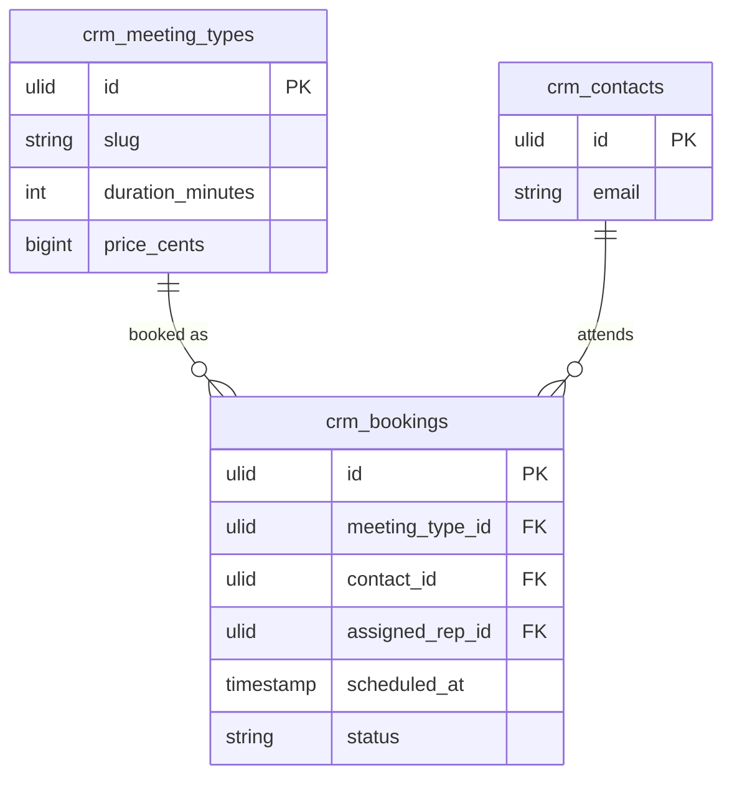

# Feature — Public Booking

## Purpose

Let a prospect self-book a meeting from a public Vue + Inertia page without authenticating, creating a contact and a logged activity in the process.

## Flow

1. Prospect visits `/book/{company-slug}/{meeting-slug}` — `PublicBookingController@show` renders `Booking/Show.vue`.
2. Page requests available slots; `SchedulingService::slots(meetingTypeSlug, day)` returns working hours minus existing bookings and buffers.
3. Prospect picks a slot and submits `BookSlotData` (name, email, notes) via POST (rate-limited `public-booking`, honeypot).
4. `SchedulingService::book()` runs in a transaction: re-validates the slot (`SlotTakenException` on collision), runs round-robin assignment, find-or-creates the [[../../contacts/_module|Contact]], logs an [[../../activities/_module|Activity]], and queues the confirmation mail + `.ics`.
5. For a priced meeting type, a Stripe PaymentIntent must succeed before confirmation.
6. `Booking/Confirm.vue` shows the confirmation.

## Rules

- Public routes run on an isolated guest guard, tenant resolved from `{company-slug}` (see [[../security]]).
- POST is rate-limited and honeypot-protected.
- Slot freeness is authoritative at `book()` time, not at page render.

## Data Touched

- Owns / writes: `crm_meeting_types`, `crm_bookings`, `crm_availability`
- Reads: `crm_contacts` (find-or-create via Contacts service API)
- Cross-domain writes: via events only ([[../../../../security/data-ownership]]) — Contact find-or-create + Activity log go through the owning-service APIs / `AppointmentBooked` event, never direct table writes

## UI
- **Kind**: public-vue (external unauthenticated booking page)
- **Page**: `Booking/Show.vue` + `Booking/Confirm.vue` — route `/book/{company-slug}/{meeting-slug}`
- **Layout**: meeting summary + day picker + available-slot grid; confirmation screen post-book
- **Key interactions**: pick a day, pick a slot, submit name/email/notes; Stripe PaymentIntent for priced types
- **States**: empty (no slots that day) · loading (fetching slots) · error (`SlotTakenException` on collision / payment failed) · selected (chosen slot highlighted)
- **Gating**: public guest guard, tenant resolved from `{company-slug}`; rate-limited `public-booking` + honeypot (no permission — unauthenticated)

## Relations
- Consumes: nothing inbound (entry point)
- Feeds: `AppointmentBooked` → consumed by activities (auto-log meeting) and sequences (auto-halt)
- Shared entity: `crm_contacts` (owned by Contacts)
