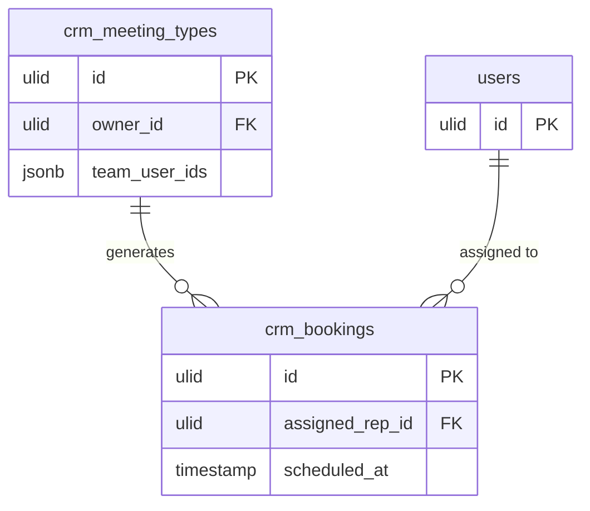

# Feature — Round-Robin Assignment

## Purpose

Distribute bookings for a team meeting type fairly across a pool of reps so no single rep is overloaded.

## Flow

1. A meeting type with `owner_id` null (or an explicit `team_user_ids` pool) is a team type *(assumed)*.
2. When `SchedulingService::book()` runs, it selects the rep from the pool with the fewest bookings this week — least-loaded *(assumed)*.
3. The chosen rep is written to `crm_bookings.assigned_rep_id`.
4. Slot re-validation is per-rep, so the assigned rep is not double-booked.

## Rules

- Pool membership comes from `team_user_ids`; an empty pool falls back to `owner_id`.
- Assignment considers only bookings in the current week for load balancing *(assumed)*.
- The assigned rep receives the confirmation and reminder like any owner.

## Data Touched

- Owns / writes: `crm_meeting_types` (`team_user_ids` pool config), `crm_bookings` (`assigned_rep_id`)
- Reads: rep/user identity (foundation) for pool membership + per-week load
- Cross-domain writes: via events only ([[../../../../security/data-ownership]])

## UI
- **Kind**: background / service (assignment logic invoked at `book()` time; pool config surfaces on the scheduling settings page)
- **Page**: no dedicated page — pool configured on `MeetingTypeResource` (edit form) within `/crm`; assignment is server-side
- **Layout**: `team_user_ids` multi-select on the meeting-type form
- **Key interactions**: admin selects rep pool for a team meeting type; assignment itself has no UI
- **States**: empty (no pool → falls back to `owner_id`) · loading (n/a — synchronous in booking txn) · error (no eligible rep) · selected (assigned rep shown on the resulting booking)
- **Gating**: `crm.scheduling` (config); booking-time assignment inherits the public booking guard

## Relations
- Consumes: invoked inline by `SchedulingService::book()` (same-module)
- Feeds: chosen rep written to the booking → carried in `AppointmentBooked` payload
- Shared entity: rep/user identity (foundation)

## Test Checklist

### Unit
- [ ] Least-loaded selection picks the rep with the fewest bookings this week from the pool *(assumed cadence)*
- [ ] Empty `team_user_ids` pool falls back to `owner_id`; no eligible rep raises the expected error

### Feature (Pest)
- [ ] `book()` on a team meeting type assigns exactly one rep and writes `assigned_rep_id`, then the assigned rep is not double-booked (per-rep slot re-validation)
- [ ] Assignment is tenant-scoped: only reps in the current company's pool are eligible
- [ ] The assigned rep receives the confirmation/reminder like an owner
