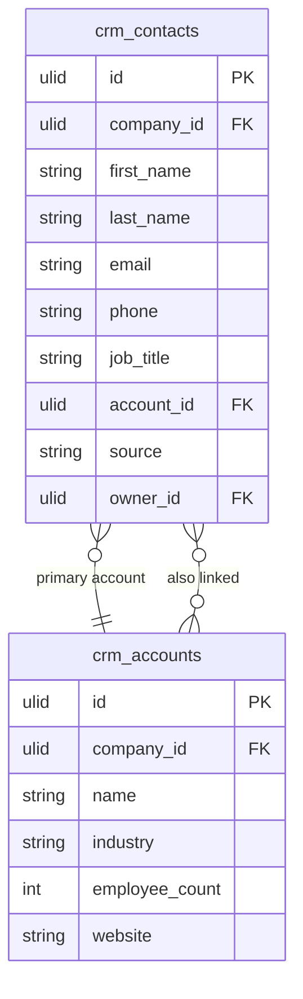

# Contacts

Contact and company (account) records with communication history, relationship mapping, and activity timeline. The foundation of all CRM activity.

---

## Core Features

- Contact records: first name, last name, email, phone, job title, company, address
- Company (account) records: name, industry, size, website, address — contacts linked to companies
- Relationship mapping: a contact can belong to multiple companies
- Communication history: all activities (calls, emails, meetings) appear on contact timeline
- Tags: polymorphic tagging via `spatie/laravel-tags`
- Custom fields: company-specific attributes via `spatie/laravel-schemaless-attributes` (when active)
- Duplicate detection on import and create (same email)
- Import via Core Data Import: CSV contact upload with column mapping
- Export via `pxlrbt/filament-excel`
- Contact source tracking (website, referral, LinkedIn, manual)
- **Lead status field**: `crm_contacts.lifecycle_stage` enum (`lead | marketing_qualified | sales_qualified | opportunity | customer | churned`) — FlowFlex does NOT have a separate Lead model. A "lead" is a contact with `lifecycle_stage = lead`. This eliminates the HubSpot Lead-to-Contact conversion complexity. Reps move contacts through lifecycle stages as they qualify.

---

## Data Model

| Table | Key Columns |
|---|---|
| `crm_contacts` | company_id, first_name, last_name, email, phone, job_title, account_id, source, owner_id, deleted_at |
| `crm_accounts` | company_id, name, industry, employee_count, website, phone, owner_id, deleted_at |
| `crm_contact_accounts` | contact_id, account_id, company_id, title, is_primary |

---

## Filament

**Nav group:** Contacts

- `ContactResource` — list (search, filter by owner/account/tag), create, edit, view
- View page: contact card + tabs (Overview, Activities, Deals, Files)
- `AccountResource` — list, create, edit companies; view shows contacts and deals
- Import from [[domains/core/data-import]]

---

## Related

- [[domains/crm/deals]]
- [[domains/crm/activities]]
- [[architecture/packages]] (`spatie/laravel-tags`)
