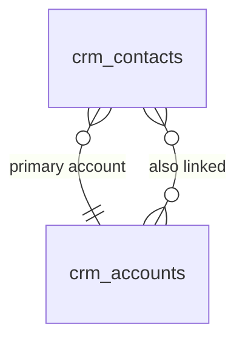

# Contacts

Contact and company (account) records with communication history, relationship mapping, and activity timeline. The foundation of all CRM activity — the CRM anchor, build first in `/crm`.

---

## Dependencies

| Type | Module | Why |
|---|---|---|
| Hard | [[domains/core/billing-engine\|core.billing]] + [[domains/core/rbac\|core.rbac]] | gating + permissions |
| Soft | [[domains/core/data-import\|core.import]] | CSV contact import; manual entry without it |
| Soft | [[domains/crm/activities\|crm.activities]] | timeline tab; hidden without it |
| Soft | [[domains/crm/deals\|crm.deals]] | deals tab; hidden without it |

---

## Core Features

- Contact records: first name, last name, email, phone, job title, company, address
- Company (account) records: name, industry, size, website, address — contacts linked to companies
- Relationship mapping: a contact can belong to multiple companies
- Communication history: all activities (calls, emails, meetings) appear on contact timeline
- Tags: polymorphic tagging via `spatie/laravel-tags`
- Custom fields: company-specific attributes via `spatie/laravel-schemaless-attributes` per [[architecture/patterns/custom-fields]] (when configured)
- Duplicate detection on import and create (same email)
- Import via Core Data Import: CSV contact upload with column mapping
- Export via `pxlrbt/filament-excel`
- Contact source tracking (website, referral, LinkedIn, manual)
- **Lead status field**: `crm_contacts.lifecycle_stage` enum (`lead | marketing_qualified | sales_qualified | opportunity | customer | churned`) — FlowFlex does NOT have a separate Lead model. A "lead" is a contact with `lifecycle_stage = lead`. This eliminates the HubSpot Lead-to-Contact conversion complexity. Reps move contacts through lifecycle stages as they qualify.

---

## Data Model

### crm_contacts

| Column | Type | Constraints | Notes |
|---|---|---|---|
| id, company_id (indexed) | ulid | | |
| first_name / last_name | string | not null | searchable |
| email | string | nullable | unique `(company_id, email)` where not null — duplicate detection |
| phone | string | nullable | E.164 |
| job_title | string | nullable | |
| account_id | ulid | nullable FK crm_accounts | primary account |
| lifecycle_stage | string | not null default `lead` | enum, plain string (no state machine — any stage move allowed) |
| source | string | nullable | website / referral / linkedin / manual / form / event |
| owner_id | ulid | not null FK users | |
| custom_fields | jsonb | default `{}` | schemaless attributes |
| deleted_at | timestamp | nullable | anonymised on DSAR per [[architecture/data-lifecycle]] |

**Indexes:** `(company_id, lifecycle_stage)`, `(company_id, owner_id)`, `(company_id, account_id)`

### crm_accounts

| Column | Type | Notes |
|---|---|---|
| id, company_id (indexed) | ulid | |
| name | string | not null |
| industry | string nullable | |
| employee_count | int nullable | |
| website / phone | string nullable | |
| owner_id | ulid FK users | |
| lifetime_value_cents | bigint default 0 | updated by InvoicePaid listener |
| custom_fields | jsonb default `{}` | |
| deleted_at | timestamp nullable | |

### crm_contact_accounts

| Column | Type | Notes |
|---|---|---|
| id, contact_id FK, account_id FK, company_id | ulid | unique `(contact_id, account_id)` |
| title | string nullable | role at that company |
| is_primary | boolean default false | one primary per contact |



---

## DTOs

### CreateContactData
| Field | Type | Validation |
|---|---|---|
| first_name / last_name | string | required, max:100 |
| email | ?string | nullable, email, unique per company ("A contact with this email already exists.") |
| phone | ?string | nullable, phone:AUTO |
| job_title | ?string | max:150 |
| account_id | ?string | ulid in company |
| lifecycle_stage | string | in enum, default lead |
| source | ?string | in set |
| owner_id | string | required, ulid in company |
| custom_fields | array | dynamic rules per [[architecture/patterns/custom-fields]] |
| tags | array<string> | |

### ContactData (output) — id, full_name, email, phone, job_title, account_id, account_name, lifecycle_stage, source, owner_name, tags[], custom_fields

## Services & Actions

Interface→Service: `ContactServiceInterface` → `ContactService`.

- `create(CreateContactData $data): ContactData` / `update(...)`
- `findOrCreateByEmail(string $email, array $attributes = []): ContactData` — the listener entry point (form submissions, event registrations); idempotent by email
- `moveLifecycleStage(string $contactId, string $stage): ContactData`
- `merge(string $keepId, string $mergeId): ContactData` — duplicate resolution; reassigns activities/deals, audited *(assumed)*
- `linkAccount(string $contactId, string $accountId, ?string $title, bool $isPrimary): void`

## Events

### Consumes (queued + WithCompanyContext, contracts in [[architecture/event-bus]]):
- `FormSubmissionReceived` (marketing, P3) → find-or-create contact, attach submission activity
- `EventRegistrationReceived` (events, P3) → find-or-create contact
- `InvoicePaid` (finance) → update account `lifetime_value_cents` + last-payment activity (no-op when `crm_account_id` null)

---

## Filament

**Nav group:** Contacts

| Artifact | Kind ([[architecture/ui-strategy]] row) | Notes |
|---|---|---|
| `ContactResource` | #1 CRUD resource | search, filters: owner/account/stage/tag; lifecycle stage quick-move; excel export |
| Contact view page | #2 detail with tabs | Overview, Activities (soft-dep), Deals (soft-dep), Files |
| `AccountResource` | #1 CRUD resource | view shows contacts + deals + LTV |


**Access contract:** every artifact above gates on `canAccess() = Auth::user()->can('crm.contacts.view-any') && BillingService::hasModule('crm.contacts')` per [[architecture/filament-patterns]] #1 — custom pages state it explicitly. Public/portal surfaces use a guest or scoped-portal guard (Vue+Inertia per [[architecture/ui-strategy]]).

**Security notes** (per [[build/security-audit-2026-06-11]]):

- **Rate limiter** (medium): Cite a named rate limiter for the import upload and export actions, and note throttling/dedupe on contact-creating event listeners.

---

## Permissions

`crm.contacts.view-any` · `crm.contacts.view` · `crm.contacts.create` · `crm.contacts.update` · `crm.contacts.delete` · `crm.contacts.merge` · `crm.accounts.manage`

---

## Search & Realtime

Meilisearch (Scout): contacts — first_name, last_name, email, job_title, account name; accounts — name, industry, website. CRM global search surface. Realtime: none.

---

## Test Checklist

- [ ] Tenant isolation + module gating
- [ ] Duplicate email per company rejected with message; cross-company same email allowed
- [ ] `findOrCreateByEmail` idempotent (two calls = one contact)
- [ ] `InvoicePaid` listener updates account LTV; null account no-op
- [ ] Merge reassigns related records + audited
- [ ] Lifecycle stage enum enforced; any-stage moves allowed
- [ ] Custom fields validate against company definitions; unknown keys stripped
- [ ] Meilisearch returns only current company's contacts (tenant-safe search per [[architecture/search]])

---

## Build Manifest

```
database/migrations/xxxx_create_crm_accounts_table.php
database/migrations/xxxx_create_crm_contacts_table.php
database/migrations/xxxx_create_crm_contact_accounts_table.php
app/Models/CRM/{Contact,Account,ContactAccount}.php
app/Data/CRM/{CreateContactData,UpdateContactData,ContactData,AccountData}.php
app/Contracts/CRM/ContactServiceInterface.php
app/Services/CRM/ContactService.php
app/Providers/CRM/CRMServiceProvider.php
app/Listeners/CRM/{CreateContactFromFormListener,CreateContactFromRegistrationListener,UpdateAccountLtvListener}.php
app/Filament/CRM/Resources/{ContactResource,AccountResource}.php
database/factories/CRM/{ContactFactory,AccountFactory}.php
tests/Feature/CRM/{ContactTest,ContactDuplicateTest,ContactListenersTest}.php
```

---

## Related

- [[domains/crm/deals]]
- [[domains/crm/activities]]
- [[architecture/patterns/custom-fields]]
- [[architecture/search]]
- [[architecture/event-bus]]
