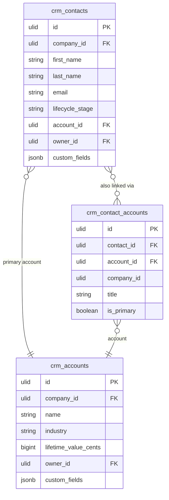

# Contacts — Data Model

## crm_contacts

| Column | Type | Constraints | Notes |
|---|---|---|---|
| id, company_id (indexed) | ulid | | |
| first_name / last_name | string | not null | searchable |
| email | string | nullable | unique `(company_id, email)` where not null — duplicate detection |
| phone | string | nullable | E.164 |
| job_title | string | nullable | |
| account_id | ulid | nullable FK crm_accounts | primary account |
| lifecycle_stage | string | not null default `lead` | enum, plain string (no state machine — any stage move allowed) |
| source | string | nullable | website / referral / linkedin / manual / form / event |
| owner_id | ulid | not null FK users | |
| custom_fields | jsonb | default `{}` | schemaless attributes |
| deleted_at | timestamp | nullable | anonymised on DSAR per [[../../../architecture/data-lifecycle]] |

**Indexes:** `(company_id, lifecycle_stage)`, `(company_id, owner_id)`, `(company_id, account_id)`

---

## crm_accounts

| Column | Type | Notes |
|---|---|---|
| id, company_id (indexed) | ulid | |
| name | string | not null |
| industry | string nullable | |
| employee_count | int nullable | |
| website / phone | string nullable | |
| owner_id | ulid FK users | |
| lifetime_value_cents | bigint default 0 | updated by InvoicePaid listener |
| custom_fields | jsonb default `{}` | |
| deleted_at | timestamp nullable | |

---

## crm_contact_accounts

| Column | Type | Notes |
|---|---|---|
| id, contact_id FK, account_id FK, company_id | ulid | unique `(contact_id, account_id)` |
| title | string nullable | role at that company |
| is_primary | boolean default false | one primary per contact |

---

## ERD

