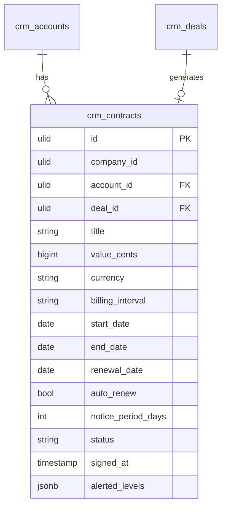

# Contracts — Data Model

## crm_contracts

| Column | Type | Notes |
|---|---|---|
| id | ulid | PK. |
| company_id | ulid | Indexed, tenant scope. |
| account_id | ulid | Not null, FK → CRM account. |
| deal_id | ulid | Nullable, FK → `crm_deals`. |
| title | string | Not null. |
| value_cents | bigint | ≥ 0. |
| currency | string(3) | ISO currency. |
| billing_interval | string | one-off / monthly / yearly *(assumed)*; drives recurring-revenue calc. |
| start_date | date | |
| end_date | date | Must be after `start_date`. |
| renewal_date | date | Nullable. |
| auto_renew | bool | Default false. |
| notice_period_days | int | Default 30. |
| status | string | Default `draft`; state machine. |
| signed_at | timestamp | Nullable. |
| alerted_levels | jsonb | Default `[]`; 90/30-day once-guards. |
| deleted_at | timestamp | Nullable, soft delete. |

### Indexes

- `company_id`
- `status`
- `renewal_date`

## ERD

