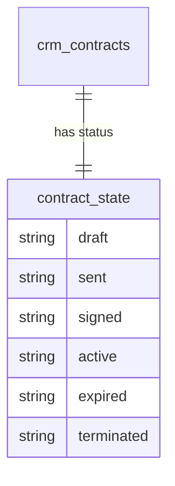

# Feature — Contract Lifecycle

Manages a contract from creation through activation, expiry, or termination.

## Flow

1. **Create** — `ContractService::createFromDeal(dealId)` prefills account and value from the won deal (or accepted quote). Contract starts in `draft`.
2. **Send** — `crm.contracts.send` moves `draft → sent`.
3. **Sign** — operator uploads the signed PDF; `crm.contracts.sign-off` moves `sent → signed` and sets `signed_at`. Upload is `application/pdf` only, stored via Media Library.
4. **Activate** — when `start_date` is reached, `ContractLifecycleCommand` (daily 05:30) moves `signed → active`; can also be done manually.
5. **Expire** — when `end_date` passes with no renewal, the command moves `active → expired`.
6. **Terminate** — `crm.contracts.terminate` with a required reason moves `active → terminated`; audited.

## State transitions

## Notes

- The lifecycle command is re-run safe; activation and expiry are idempotent.
- E-signature is manual signed-PDF upload for v1 *(assumed)*; DocuSign deferred.

## UI
- **Kind**: simple-resource with state-transition actions.
- **Page**: `ContractResource` (list + view/edit) in the CRM panel; lifecycle actions (Send, Sign-off, Terminate) as record actions.
- **Layout**: contract detail (account, deal, value, dates, renewal terms, status badge) with a signed-PDF upload and an action bar reflecting the current state.
- **Key interactions**: create-from-deal prefill; Send (`draft→sent`); Sign-off (PDF upload → `sent→signed`, sets `signed_at`); Terminate (required reason → `active→terminated`). Activate/Expire are driven by the daily command.
- **States**: empty (no contracts — create/create-from-deal) · loading (saving/transition) · error (missing PDF on sign-off, missing reason on terminate) · selected (viewing a contract with state-appropriate actions)
- **Gating**: `crm.contracts.view` · `crm.contracts.send` · `crm.contracts.sign-off` · `crm.contracts.terminate`.

## Data
- Owns / writes: `crm_contracts` — status, `signed_at`, termination reason; signed-PDF attachment via Media Library.
- Reads: `crm_deals` (won deal for prefill), `crm_quotes` (accepted quote for prefill) — read-only.
- Cross-domain writes: via events only ([[../../../../security/data-ownership]]).

## Relations
- Consumes: a won deal (`crm_deals`) / accepted quote (`crm_quotes`) as the create-from source — read-only query, not an event.
- Feeds: nothing cross-domain in v1 — recurring-revenue tracking reads `crm_contracts`; a feed to finance for recurring invoicing is *(assumed)* and deferred.
- Shared entity: `crm_deals` and `crm_accounts` (owned by [[../../deals/_module|crm.deals]] / accounts), read-only.

## Test Checklist

### Unit
- [ ] State machine allows only the defined transitions (draft→sent→signed→active→expired|terminated, active→active renew) and blocks others
- [ ] Sign-off requires an attached `application/pdf`; terminate requires a reason

### Feature (Pest)
- [ ] `createFromDeal` prefills account + value and starts the contract in `draft`
- [ ] Each transition (send / sign-off / terminate) requires its own permission and is denied without it
- [ ] Every status transition is serialised via `DB::transaction()` + `lockForUpdate()` — concurrent transitions cannot double-apply; tenant-scoped throughout
- [ ] `ContractLifecycleCommand` is idempotent — re-run does not re-activate or re-expire

### Livewire
- [ ] State-appropriate action bar: Send visible in `draft`, Sign-off in `sent`, Terminate in `active`
- [ ] `canAccess` / action gating denies transitions for a user missing the verb; missing-PDF / missing-reason errors surface inline
