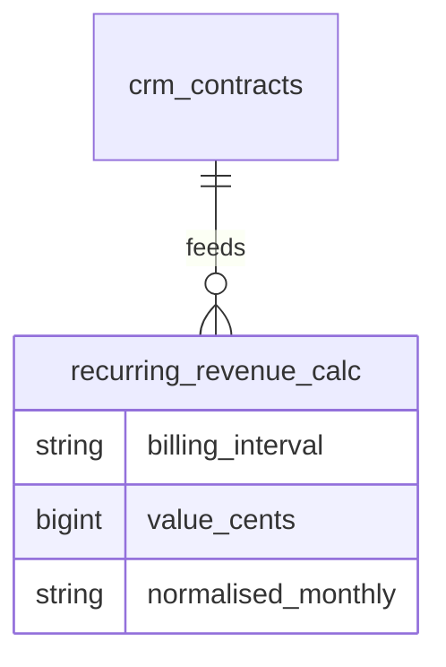

# Feature — Renewal Tracking

Tracks renewal dates, auto-renewal, notice periods, and pre-expiry alerts, feeding recurring-revenue reporting.

## Fields

- `renewal_date` — when the contract is up for renewal.
- `auto_renew` — if true, the lifecycle command renews rather than expires.
- `notice_period_days` — default 30.
- `alerted_levels` jsonb — once-guards for 90 / 30-day alerts *(assumed cadence)*.

## Flow

1. `ContractLifecycleCommand` (daily 05:30) scans active contracts approaching `end_date`.
2. At 90 and 30 days before expiry, if the level is not yet in `alerted_levels`, it fires a renewal notification (core.notifications) and records the level.
3. At `end_date`: if `auto_renew`, `ContractService::renew(contractId, newEnd)` sets new end/renewal dates (audited); otherwise the contract expires.
4. `ContractService::recurringRevenue()` sums active recurring contracts, normalising yearly → monthly via brick/money.

## Widget

`ContractRenewalWidget` (Pipeline nav group) surfaces renewals due in the next 90 days.

## Recurring revenue

## Notes

- Alert cadence (90/30) is *(assumed)* and overridable via ADR.
- Only `active` recurring contracts contribute to recurring revenue.

## UI
- **Kind**: custom-page — a "renewals due" queue/board. *(Chosen over widget: the renewals queue is a filterable, actionable worklist — renew/terminate per row — which outgrows the read-only `ContractRenewalWidget` glance card; the widget stays as the dashboard summary.)*
- **Page**: Renewals page (Pipeline nav group), route `/crm/renewals`; plus `ContractRenewalWidget` on the CRM dashboard.
- **Layout**: table/board of contracts due within N days (renewal date, account, value, auto-renew, days-to-expiry), grouped by urgency (90 / 30 / overdue).
- **Key interactions**: renew (set new end/renewal dates) or terminate per row; filter by window; jump to the contract.
- **States**: empty (no renewals due) · loading (list fetch) · error (action failure) · selected (contract row focused for renew/terminate)
- **Gating**: `crm.contracts.view` to list; `crm.contracts.renew` / `crm.contracts.terminate` for actions.

## Data
- Owns / writes: `crm_contracts` — `renewal_date`, `auto_renew`, `notice_period_days`, `alerted_levels`, and renew updates (new end/renewal dates).
- Reads: `crm_contracts` (self) only.
- Cross-domain writes: via events only ([[../../../../security/data-ownership]]).

## Relations
- Consumes: nothing cross-domain (driven by the daily `ContractLifecycleCommand`).
- Feeds: renewal-alert notifications via core.notifications; recurring-revenue figures read from `crm_contracts`. A feed to finance for recurring invoicing is *(assumed)* and deferred.
- Shared entity: none written cross-domain; `crm_accounts` referenced read-only for display.

## Test Checklist

### Unit
- [ ] 90 / 30-day alert levels fire once each via the `alerted_levels` once-guard *(assumed cadence)*
- [ ] `recurringRevenue()` normalises yearly → monthly via brick/money (no float math) and counts only `active` recurring contracts

### Feature (Pest)
- [ ] `ContractLifecycleCommand` renews when `auto_renew` (audited, new end/renewal dates) and expires otherwise at `end_date`
- [ ] Alert command is idempotent — a second run in the same window fires no duplicate notification
- [ ] Command and widget are tenant-scoped — company A never sees company B renewals

### Livewire
- [ ] Renewals queue lists contracts due within the window grouped by urgency; renew / terminate row actions require their permissions (`crm.contracts.renew` / `.terminate`)
- [ ] `ContractRenewalsPage` `canAccess()` enforces permission + `hasModule('crm.contracts')`
