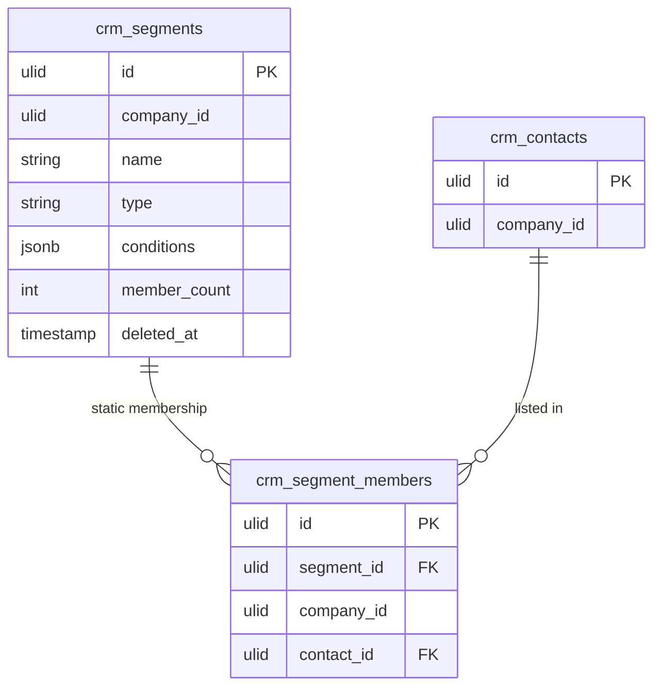

# Customer Segments — Data Model

## crm_segments

| Column | Type | Notes |
|---|---|---|
| id | ulid | PK |
| company_id | ulid | Indexed; tenant scope |
| name | string | Unique per company |
| type | string | `dynamic` / `static` |
| conditions | jsonb | `{logic: and/or, rules:[{field,operator,value}]}` — dynamic only |
| member_count | int | Cached snapshot, refreshed nightly |
| deleted_at | timestamp | Nullable (soft delete) |

Indexes: `company_id`; unique `(company_id, name)`.

## crm_segment_members

Static lists only.

| Column | Type | Notes |
|---|---|---|
| id | ulid | PK |
| segment_id | ulid | FK → crm_segments |
| company_id | ulid | Tenant scope |
| contact_id | ulid | FK → crm_contacts |

Indexes: unique `(segment_id, contact_id)`.

> `conditions` is a JSONB document holding the AND/OR rule tree for dynamic segments. Static segments leave it null and use `crm_segment_members` instead.

## ERD

