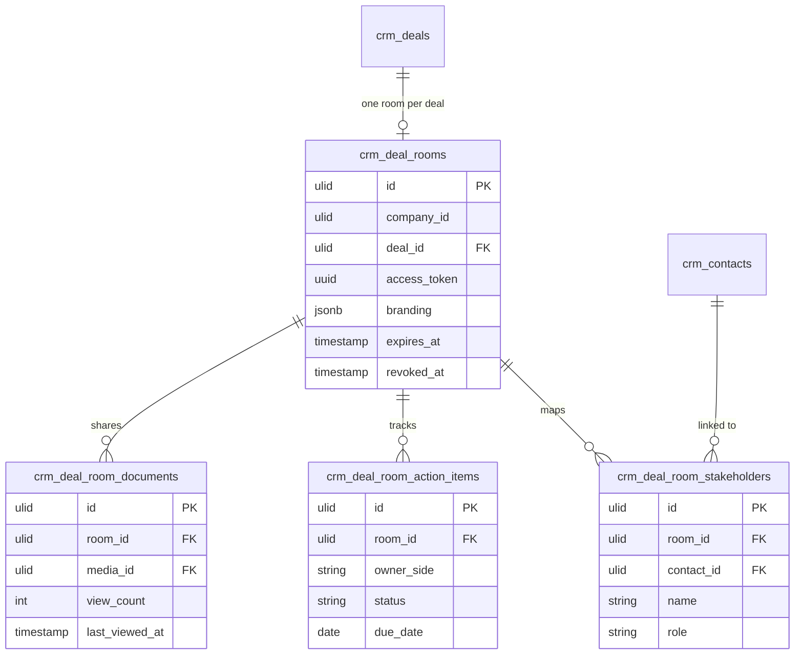

# Deal Rooms — Data Model

## crm_deal_rooms

| Column | Type | Notes |
|---|---|---|
| id | ulid | PK. |
| company_id | ulid | Indexed, tenant scope. |
| deal_id | ulid | FK, unique — one room per deal. |
| access_token | uuid | Unique; public link. |
| branding | jsonb | Logo / colour overrides. |
| expires_at | timestamp | Default deal close date + 30d *(assumed)*. |
| revoked_at | timestamp | Nullable. |

## crm_deal_room_documents

| Column | Type | Notes |
|---|---|---|
| id | ulid | PK. |
| room_id | ulid | FK → `crm_deal_rooms`. |
| company_id | ulid | Tenant scope. |
| media_id | ulid | FK → media (tenant-scoped file). |
| view_count | int | Default 0. |
| last_viewed_at | timestamp | Nullable. |

## crm_deal_room_action_items

| Column | Type | Notes |
|---|---|---|
| id | ulid | PK. |
| room_id | ulid | FK → `crm_deal_rooms`. |
| company_id | ulid | Tenant scope. |
| description | string | |
| owner_side | string | buyer / seller. |
| status | string | Default `open` (open / done). |
| due_date | date | Nullable. |

## crm_deal_room_stakeholders

| Column | Type | Notes |
|---|---|---|
| id | ulid | PK. |
| room_id | ulid | FK → `crm_deal_rooms`. |
| company_id | ulid | Tenant scope. |
| name | string | |
| role | string | |
| contact_id | ulid | Nullable, FK → `crm_contacts`. |

## ERD

