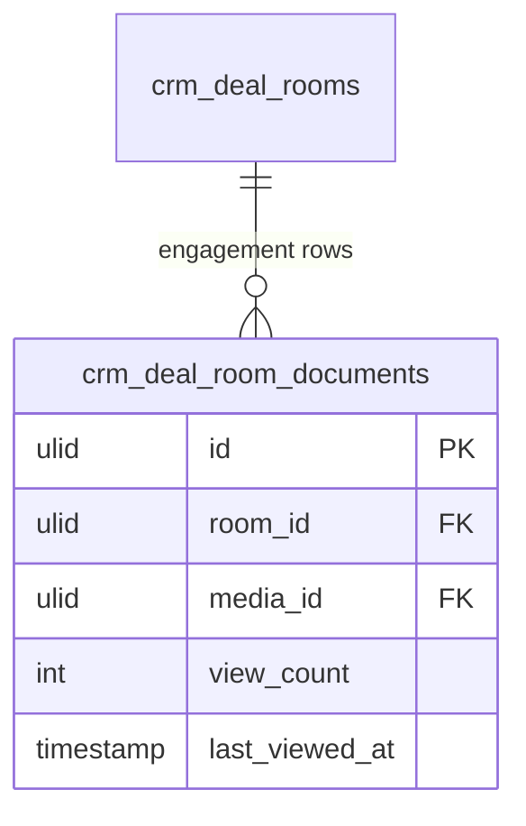

# Feature — Engagement Tracking

Records which buyers viewed which documents and when, surfacing buyer intent to the seller.

## Flow

1. Buyer opens a shared document in the room.
2. `TrackDocumentViewAction::run(token, documentId)` increments `view_count` and stamps `last_viewed_at` on the `crm_deal_room_documents` row, then returns a signed temp URL.
3. The Filament `DealRoomResource` engagement panel shows per-document view counts and last-viewed timestamps for the seller.

## Data touched

- Owns / writes: `crm_deal_room_documents` (`view_count`, `last_viewed_at`), `crm_deal_room_action_items` (completion signal)
- Reads: `crm_deal_rooms` (parent room, own module)
- Cross-domain writes: via events only ([[../../../../security/data-ownership]])

## UI
- **Kind**: background (records buyer opens/downloads; surfaces as a widget/timeline on the internal deal-room page)
- **Page**: engagement panel on `DealRoomResource` (custom deal-room management page) within `/crm`; capture itself is server-side via `TrackDocumentViewAction`
- **Layout**: per-document view-count + last-viewed timeline for the seller
- **Key interactions**: buyer view triggers tracking; seller reads the engagement panel (read-only)
- **States**: empty (no views yet) · loading (panel fetch) · error (tracking write failure — non-blocking) · selected (drill into a document's view history)
- **Gating**: buyer capture via guest guard; seller panel gated `crm.deal-rooms`

## Relations
- Consumes: buyer document-open from the token portal (same-module)
- Feeds: `DealRoomViewed` / engagement events → consumed by revenue-intelligence (deal health signal)
- Shared entity: `crm_deals` (via parent room)

## Notes

- View tracking increments once per view event (test-covered).
- Action-item completion by `owner_side` is a second, lighter engagement signal.
- Real-time notification to the deal owner on view is an open question (see [[../unknowns]]).
