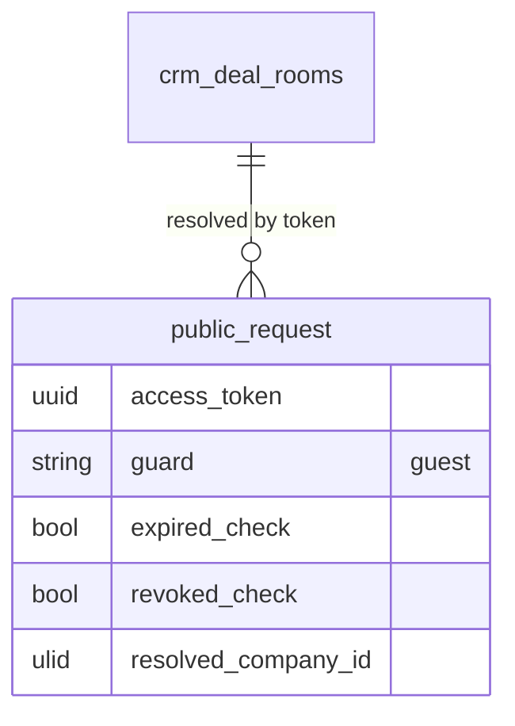

# Feature — Tokenised Access

External buyers reach a deal room through a unique, expiring, revocable link — no buyer account required.

## Flow

1. Seller creates a room via `DealRoomService::create(CreateDealRoomData)`; a `access_token` (uuid) and `expires_at` (default deal close + 30d *(assumed)*) are set.
2. The room link `/room/{token}` is shared with the buyer.
3. `PublicDealRoomController` (guest guard, rate-limited) resolves the token via `DealRoomService::publicView(token)`.
4. If the token is expired (`expires_at` past) or revoked (`revoked_at` set), the route returns 404.
5. Company context is derived from the token — the public route never touches the authenticated app guard.
6. Seller can revoke at any time via `RevokeRoomAction::run(roomId)`.

## Access resolution

## UI
- **Kind**: public-vue (buyer-facing portal via a signed token, no login)
- **Page**: `DealRoom/Show.vue` — route `/room/{token}`
- **Layout**: branded room header (logo/colours) + shared documents list + mutual action plan + stakeholder map
- **Key interactions**: buyer opens documents (view logged), toggles buyer-side action items; no uploads in v1 *(assumed)*
- **States**: empty (no documents yet) · loading (resolving token / fetching signed URLs) · error (expired / revoked token → 404) · selected (open document)
- **Gating**: guest guard, company context derived from `access_token`; rate-limited (unauthenticated — no permission)

## Data
- Owns / writes: `crm_deal_rooms` (`access_token`, `expires_at`, `revoked_at`), `crm_deal_room_action_items` (buyer-side toggles), `crm_deal_room_documents` (view logging)
- Reads: `crm_deals`, `crm_contacts`, `crm_quotes` (assembled as room assets, read-only)
- Cross-domain writes: via events only ([[../../../../security/data-ownership]])

## Relations
- Consumes: room assets read from Deals / Contacts / Quotes (owning-service APIs)
- Feeds: `DealRoomViewed` / engagement events → consumed by revenue-intelligence (deal health)
- Shared entity: `crm_deals` (owned by Deals)

## Notes

- Buyers cannot upload in v1 *(assumed)*; writes limited to action-item toggles and view logging.
- Shared documents are served via signed temp URLs — raw media paths are never exposed.
