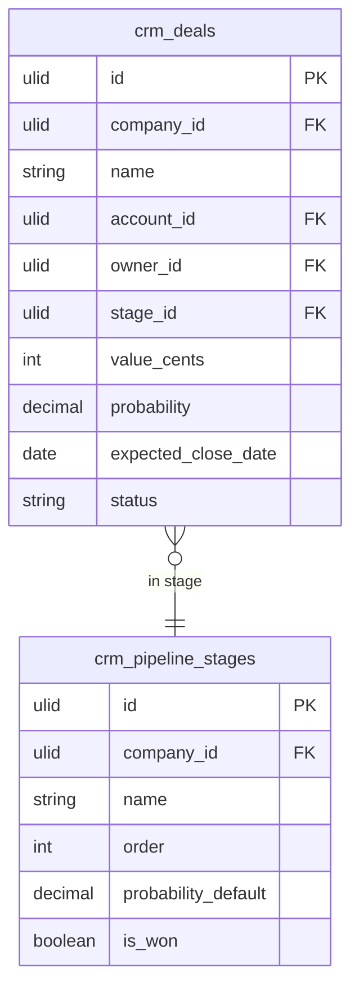

# Deals

Deal records with value, stage, probability, close date, products/services, and owner. The core revenue tracking object in CRM — everything in the sales motion (pipeline board, quotes, forecasting, invoice creation) hangs off this record.

---

## Dependencies

| Type | Module | Why |
|---|---|---|
| Hard | [[domains/crm/contacts\|crm.contacts]] | Deals attach to contacts/accounts |
| Hard | [[domains/crm/pipeline\|crm.pipeline]] | Owns `crm_pipeline_stages`; deals live in stages |
| Hard | [[domains/core/billing-engine\|core.billing]] | Module gating |
| Hard | [[domains/core/rbac\|core.rbac]] | Permissions |
| Soft | [[domains/finance/invoicing\|finance.invoicing]] | `DealWon` → draft invoice stub; without it the event fires unconsumed and `CreateInvoiceAction` is hidden |
| Soft | [[domains/crm/quotes\|crm.quotes]] | Accepted quote pre-fills deal products; degrades to manual line items |
| Soft | crm.pricing (price books) | Product line items link to catalog; degrades to free-text lines |
| Soft | [[domains/crm/activities\|crm.activities]] | Activity timeline tab; tab hidden without it |

---

## Core Features

- Deal record: name, value, stage, probability, expected close date, owner, contact(s), account
- Custom pipeline stages per company (e.g. Lead → Qualified → Proposal → Won | Lost)
- Stage transitions via `spatie/laravel-model-states`
- Won/lost tracking: reason, competitor, lost-to
- Products/line items on deal: link to product catalog (if CRM Pricing module active)
- Deal age: days since last activity, days in current stage
- Deal duplication: copy deal to start a new cycle with same contact
- Invoice creation: one-click create Finance invoice from a won deal
- Activity timeline on deal: calls, emails, meetings

---

## Data Model

### crm_deals

| Column | Type | Constraints | Notes |
|---|---|---|---|
| id | ulid | PK | |
| company_id | ulid | not null, FK companies, indexed | BelongsToCompany |
| name | string | not null | |
| account_id | ulid | nullable, FK crm_accounts | |
| contact_id | ulid | nullable, FK crm_contacts | primary contact |
| owner_id | ulid | not null, FK users | |
| stage_id | ulid | not null, FK crm_pipeline_stages | |
| value_cents | bigint | not null, default 0 | minor units, brick/money |
| currency | string(3) | not null, default company currency | ISO 4217 |
| probability | decimal(5,2) | not null | % — defaults from stage `probability_default` |
| expected_close_date | date | nullable | |
| actual_close_date | date | nullable | set on won/lost |
| status | string | not null, default `open` | state machine: open / won / lost |
| lost_reason | text | nullable | required on lost transition |
| lost_to | string | nullable | competitor name *(assumed)* |
| stage_entered_at | timestamp | not null | for days-in-stage *(assumed)* |
| deleted_at | timestamp | nullable | |

**Indexes:** `(company_id, status)`, `(company_id, stage_id)`, `(company_id, owner_id)`, `(company_id, expected_close_date)`

### crm_deal_contacts

| Column | Type | Constraints | Notes |
|---|---|---|---|
| id | ulid | PK | |
| company_id | ulid | not null, indexed | |
| deal_id | ulid | not null, FK crm_deals | |
| contact_id | ulid | not null, FK crm_contacts | |
| role | string | nullable | e.g. decision-maker, champion |

**Indexes:** `(deal_id, contact_id)` unique

### crm_deal_products

| Column | Type | Constraints | Notes |
|---|---|---|---|
| id | ulid | PK | |
| company_id | ulid | not null, indexed | |
| deal_id | ulid | not null, FK crm_deals | |
| product_id | ulid | nullable, FK catalog | null = free-text line (pricing module inactive) |
| description | string | not null | *(assumed)* |
| quantity | decimal(10,2) | not null, default 1 | |
| unit_price_cents | bigint | not null | |
| discount_percent | decimal(5,2) | not null, default 0 | |



(`crm_pipeline_stages` is owned by [[domains/crm/pipeline|crm.pipeline]].)

---

## State Machine

Column: `crm_deals.status` — spatie/laravel-model-states, base `DealState`. Stage movement within `open` is NOT a state transition — it updates `stage_id` + `stage_entered_at`.

| State | Transitions to | Triggered by (permission) | Side effects |
|---|---|---|---|
| `open` | `won` | `crm.deals.close` | fires `DealWon`; sets `actual_close_date`, probability 100 |
| `open` | `lost` | `crm.deals.close` | fires `DealLost`; requires `lost_reason`; probability 0 |
| `won` | `open` | `crm.deals.reopen` *(assumed)* | clears close fields; audited |
| `lost` | `open` | `crm.deals.reopen` *(assumed)* | clears lost fields; audited |

Initial: `open`. Transitions audited via activitylog.

---

## DTOs

### CreateDealData (input)

| Field | Type | Validation |
|---|---|---|
| name | string | required, max:255 |
| account_id | ?string | nullable, ulid, exists in company |
| contact_id | ?string | nullable, ulid, exists in company |
| owner_id | string | required, ulid, exists in company |
| stage_id | string | required, ulid, exists in company, not a won/lost stage |
| value_cents | int | required, min:0 |
| currency | string | required, size:3, valid ISO 4217 |
| probability | ?float | nullable, between:0,100 — defaults from stage |
| expected_close_date | ?CarbonImmutable | nullable, date, after_or_equal:today *(assumed)* |

Cross-field: at least one of `account_id` / `contact_id` required ("A deal needs an account or a contact") *(assumed)*.

### UpdateDealData — same fields, all optional (partial update)

### CloseDealData (input)
| Field | Type | Validation |
|---|---|---|
| deal_id | string | required, ulid |
| outcome | string | required, in:won,lost |
| lost_reason | ?string | required_if:outcome,lost, max:1000 |
| lost_to | ?string | nullable, max:255 |

### DealData (output)
id, name, account_id, contact_id, owner_id, owner_name, stage_id, stage_name, value_cents, currency, value_formatted, probability, weighted_value_cents (computed), expected_close_date, actual_close_date, status, days_in_stage (computed), lost_reason

---

## Services & Actions

Interface→Service: `DealServiceInterface` → `DealService` (`Providers/CRM`).

- `create(CreateDealData $data): DealData`
- `update(string $dealId, UpdateDealData $data): DealData`
- `moveToStage(string $dealId, string $stageId): DealData` — throws `ClosedDealImmutableException`; resets `stage_entered_at`, probability from stage default
- `close(CloseDealData $data): DealData` — throws `InvalidStateTransitionException`; fires `DealWon`/`DealLost`
- `duplicate(string $dealId): DealData` — copies deal + contacts + products, status `open`, first stage *(assumed)*
- `weightedPipelineValue(?string $ownerId = null): Money` — brick/money sum of `value × probability`

---

## Events

### Fires: DealWon

| Payload field | Type | Notes |
|---|---|---|
| company_id | string | always first |
| deal_id | string | |
| account_id | ?string | |
| contact_id | ?string | |
| owner_id | string | |
| value_cents | int | |
| currency | string | ISO 4217 |
| won_at | CarbonImmutable | |

Consumed by: `finance.invoicing` (`CreateInvoiceStubListener` — draft invoice, line items from `crm_deal_products`, due date = company default terms, no auto-send), CRM sequences (`EnrollInSuccessSequenceListener`). Contract source of truth: [[architecture/event-bus]].

### Fires: DealLost

| Payload field | Type | Notes |
|---|---|---|
| company_id | string | |
| deal_id | string | |
| owner_id | string | |
| lost_reason | string | |
| lost_at | CarbonImmutable | |

No v1 consumers — analytics consumes in Phase 3 *(assumed)*.

---

## Filament

**Nav group:** Pipeline

| Artifact | Kind ([[architecture/ui-strategy]] row) | Notes |
|---|---|---|
| `DealResource` | #1 CRUD resource | list filters: stage, owner, status; bulk owner reassign *(assumed)* |
| Deal view page | #2 detail with tabs | Overview, Activities (if crm.activities), Products, Files |
| `CreateInvoiceAction` | modal action on view page | visible only when status=won AND `hasModule('finance.invoicing')` |
| `CloseDealAction` | modal action | outcome + lost_reason form |

(The Kanban board itself is [[domains/crm/pipeline|crm.pipeline]]'s `PipelineBoardPage` — ui-strategy row #3, Reverb broadcast.)


**Access contract:** every artifact above gates on `canAccess() = Auth::user()->can('crm.deals.view-any') && BillingService::hasModule('crm.deals')` per [[architecture/filament-patterns]] #1 — custom pages state it explicitly. Public/portal surfaces use a guest or scoped-portal guard (Vue+Inertia per [[architecture/ui-strategy]]).

---

## Permissions

`crm.deals.view-any` · `crm.deals.view` · `crm.deals.create` · `crm.deals.update` · `crm.deals.delete` · `crm.deals.close` · `crm.deals.reopen`

Seeded in `PermissionSeeder`.

---

## Search & Realtime

Meilisearch (Scout): `name`, account name, contact name — searchable from CRM global search *(assumed)*.
Realtime: none on DealResource (CRUD default). Board realtime lives in crm.pipeline.

---

## Test Checklist

- [ ] Tenant isolation: company A cannot see/move/close company B deals
- [ ] Module gating: resource hidden when `crm.deals` inactive
- [ ] Close as won fires `DealWon` with contract payload (value, currency, ids)
- [ ] Close as lost requires `lost_reason`; fires `DealLost`
- [ ] Closed deal cannot move stage (`ClosedDealImmutableException`)
- [ ] Stage move resets `stage_entered_at` + applies stage default probability
- [ ] `CreateInvoiceAction` hidden when finance.invoicing inactive
- [ ] Weighted pipeline value computed via brick/money (no float math)
- [ ] Duplicate copies contacts + products, resets status/stage

---

## Build Manifest

```
database/migrations/xxxx_create_crm_deals_table.php
database/migrations/xxxx_create_crm_deal_contacts_table.php
database/migrations/xxxx_create_crm_deal_products_table.php
app/Models/CRM/{Deal,DealContact,DealProduct}.php
app/States/CRM/Deal/{DealState,Open,Won,Lost}.php
app/Data/CRM/{CreateDealData,UpdateDealData,CloseDealData,DealData}.php
app/Contracts/CRM/DealServiceInterface.php
app/Services/CRM/DealService.php
app/Exceptions/CRM/{ClosedDealImmutableException}.php
app/Events/CRM/{DealWon,DealLost}.php
app/Filament/CRM/Resources/DealResource.php (+ Pages: List, Create, View, Edit)
database/factories/CRM/{DealFactory,DealProductFactory}.php
tests/Feature/CRM/{DealTest,DealCloseTest}.php
```

---

## Open Questions

- Reopen transitions (`won/lost → open`): included *(assumed)* — confirm whether reopening a won deal must void the created invoice stub (currently: no, invoice stays as draft in Finance)

---

## Related

- [[domains/crm/pipeline]]
- [[domains/crm/contacts]]
- [[domains/crm/quotes]]
- [[domains/crm/activities]]
- [[domains/finance/invoicing]]
- [[architecture/event-bus]]
- [[architecture/ui-strategy]]
