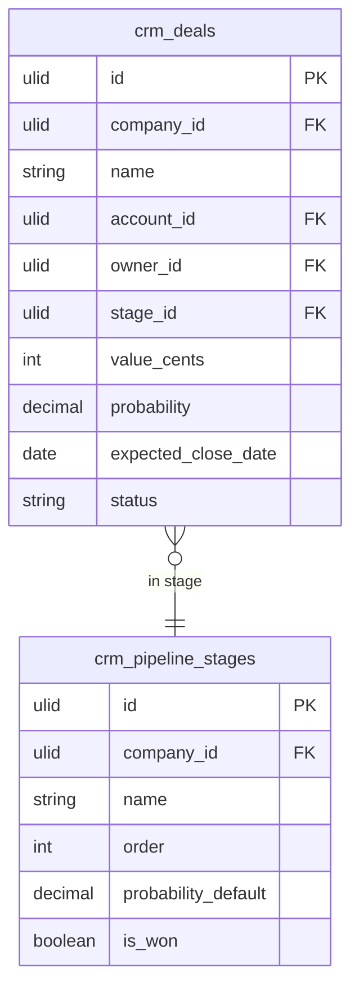

# Deals

Deal records with value, stage, probability, close date, products/services, and owner. The core revenue tracking object in CRM.

---

## Core Features

- Deal record: name, value, stage, probability, expected close date, owner, contact(s), account
- Custom pipeline stages per company (e.g. Lead → Qualified → Proposal → Won | Lost)
- Stage transitions via `spatie/laravel-model-states`
- Won/lost tracking: reason, competitor, lost-to
- Products/line items on deal: link to product catalog (if CRM Pricing module active)
- Deal age: days since last activity, days in current stage
- Deal duplication: copy deal to start a new cycle with same contact
- Invoice creation: one-click create Finance invoice from a won deal
- Activity timeline on deal: calls, emails, meetings

---

## Data Model

| Table | Key Columns |
|---|---|
| `crm_deals` | company_id, name, account_id, contact_id, owner_id, stage_id, value_cents, currency, probability, expected_close_date, actual_close_date, status (open/won/lost), lost_reason |
| `crm_pipeline_stages` | company_id, name, order, probability_default, is_won, is_lost |
| `crm_deal_contacts` | deal_id, contact_id, company_id, role |
| `crm_deal_products` | deal_id, product_id, company_id, quantity, unit_price_cents, discount_percent |

---

## Filament

**Nav group:** Pipeline

- `DealResource` — list, create, edit, view
- View page: deal card + tabs (Overview, Activities, Products, Files)
- `CreateInvoiceAction` — modal action on Won deal to create Finance invoice

---

## Related

- [[domains/crm/pipeline]]
- [[domains/crm/contacts]]
- [[domains/crm/quotes]]
- [[domains/finance/invoicing]]
