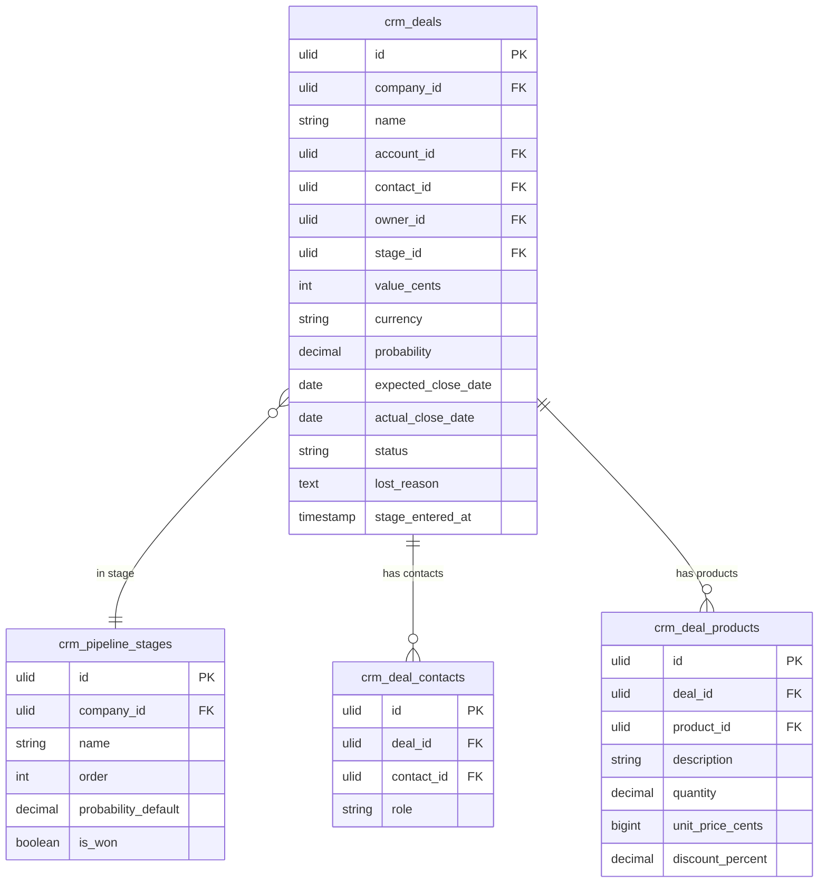

# Deals — Data Model

## crm_deals

| Column | Type | Constraints | Notes |
|---|---|---|---|
| id | ulid | PK | |
| company_id | ulid | not null, FK companies, indexed | BelongsToCompany |
| name | string | not null | |
| account_id | ulid | nullable, FK crm_accounts | |
| contact_id | ulid | nullable, FK crm_contacts | primary contact |
| owner_id | ulid | not null, FK users | |
| stage_id | ulid | not null, FK crm_pipeline_stages | |
| value_cents | bigint | not null, default 0 | minor units, brick/money |
| currency | string(3) | not null, default company currency | ISO 4217 |
| probability | decimal(5,2) | not null | % — defaults from stage `probability_default` |
| expected_close_date | date | nullable | |
| actual_close_date | date | nullable | set on won/lost |
| status | string | not null, default `open` | state machine: open / won / lost |
| lost_reason | text | nullable | required on lost transition |
| lost_to | string | nullable | competitor name *(assumed)* |
| stage_entered_at | timestamp | not null | for days-in-stage *(assumed)* |
| deleted_at | timestamp | nullable | |

**Indexes:** `(company_id, status)`, `(company_id, stage_id)`, `(company_id, owner_id)`, `(company_id, expected_close_date)`

---

## crm_deal_contacts

| Column | Type | Constraints | Notes |
|---|---|---|---|
| id | ulid | PK | |
| company_id | ulid | not null, indexed | |
| deal_id | ulid | not null, FK crm_deals | |
| contact_id | ulid | not null, FK crm_contacts | |
| role | string | nullable | e.g. decision-maker, champion |

**Indexes:** `(deal_id, contact_id)` unique

---

## crm_deal_products

| Column | Type | Constraints | Notes |
|---|---|---|---|
| id | ulid | PK | |
| company_id | ulid | not null, indexed | |
| deal_id | ulid | not null, FK crm_deals | |
| product_id | ulid | nullable, FK catalog | null = free-text line (pricing module inactive) |
| description | string | not null | *(assumed)* |
| quantity | decimal(10,2) | not null, default 1 | |
| unit_price_cents | bigint | not null | |
| discount_percent | decimal(5,2) | not null, default 0 | |

---

## ERD

(`crm_pipeline_stages` is owned by [[../../crm/pipeline/_module|crm.pipeline]].)
