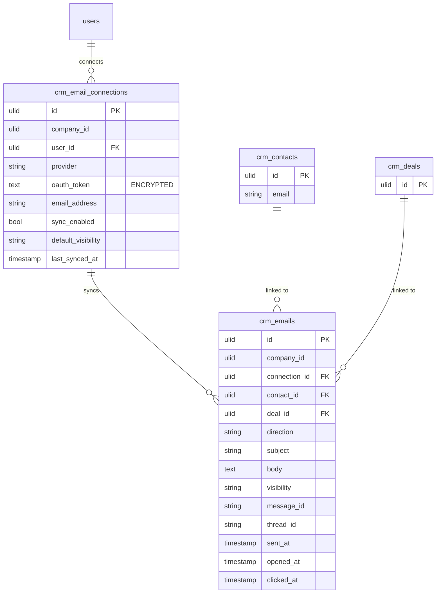

# Email Integration — Data Model

## `crm_email_connections`

| Column | Type | Notes |
|---|---|---|
| `id` | ulid | PK |
| `company_id` | ulid | Indexed, `BelongsToCompany` |
| `user_id` | ulid | FK → `users`; unique `(user_id, provider)` |
| `provider` | string | gmail / outlook |
| 🔐 `oauth_token` | text | **Encrypted** blob (access + refresh) |
| `email_address` | string | Connected mailbox |
| `sync_enabled` | bool | default `true` |
| `default_visibility` | string | default `shared` (shared / private) |
| `last_synced_at` | timestamp nullable | Incremental sync cursor |
| `created_at` / `updated_at` | timestamps | |

**Encrypted:** `oauth_token` → see [[../../../security/encryption]].

## `crm_emails`

| Column | Type | Notes |
|---|---|---|
| `id` | ulid | PK |
| `company_id` | ulid | Indexed, `BelongsToCompany` |
| `connection_id` | ulid | FK → `crm_email_connections` |
| `contact_id` | ulid nullable | FK → `crm_contacts` (matched link) |
| `deal_id` | ulid nullable | FK → `crm_deals` (matched link) |
| `direction` | string | inbound / outbound |
| `subject` | string | |
| `body` | text | HTML purified before storage — see [[../../../security/data-privacy-gdpr]] |
| `visibility` | string | shared / private |
| `message_id` | string | Provider id; unique `(connection_id, message_id)` for sync dedupe |
| `thread_id` | string nullable | Conversation grouping |
| `sent_at` | timestamp | |
| `opened_at` | timestamp nullable | Tracking |
| `clicked_at` | timestamp nullable | Tracking |

**Indexes:** `(company_id, contact_id, sent_at)`.

**GDPR:** emails of an erased contact are unlinked + body purged *(assumed — personal correspondence)*.

## ERD

