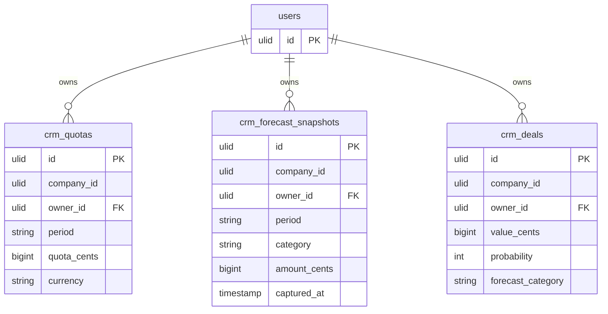

# Forecasting — Data Model

This module owns `crm_quotas` and `crm_forecast_snapshots`, and reads deal data from `crm_deals` (adding a `forecast_category` column to it).

## crm_quotas

| Column | Type | Notes |
|---|---|---|
| id | ulid | PK |
| company_id | ulid | Indexed, tenant scope |
| owner_id | FK users | Rep; team roll-up computed |
| period | string | `YYYY-MM` or `YYYY-Qn` |
| quota_cents | bigint | Target amount (minor unit) |
| currency | string(3) | ISO currency |

**Indexes:** `company_id`; unique `(company_id, owner_id, period)`.

## crm_forecast_snapshots

| Column | Type | Notes |
|---|---|---|
| id | ulid | PK |
| company_id | ulid | Indexed, tenant scope |
| owner_id | FK users | Rep |
| period | string | `YYYY-MM` or `YYYY-Qn` |
| category | string | commit / best-case / pipeline / closed |
| amount_cents | bigint | Snapshot amount (minor unit) |
| captured_at | timestamp | Weekly snapshot job |

**Indexes:** `company_id`; upsert key `(company_id, owner_id, period, category, captured_at week)`.

## crm_deals (read + augmented)

This module adds a `forecast_category` column (nullable enum: commit / best-case / pipeline / closed) to the `crm_deals` table owned by [[../deals/_module|Deals]]. Deal value, probability, stage and close dates are read for weighted-pipeline computation.

## ER Diagram

