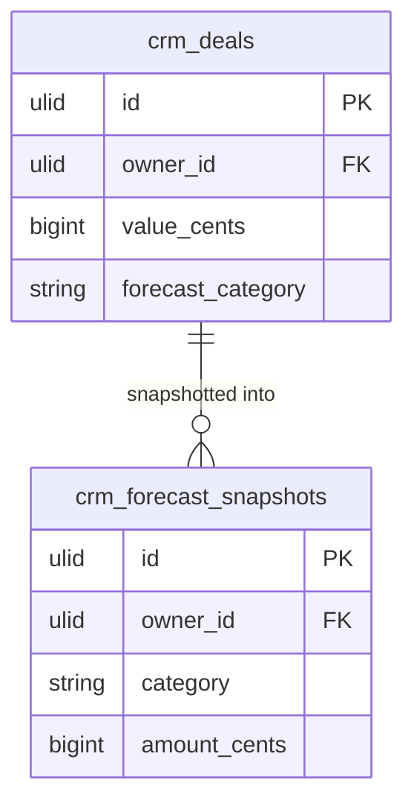

# Feature — Forecast Categories

## Purpose

Let reps manually classify open deals into forecast confidence buckets — commit, best-case, pipeline, closed — so managers can build a bottom-up forecast alongside the probability-weighted one.

## Flow

1. Rep opens a deal and sets its forecast category via `SetForecastCategoryAction::run(dealId, category)`.
2. Action validates the deal is open (closed deals derive their category automatically) *(assumed)*.
3. Value is written to the `forecast_category` column on `crm_deals` *(assumed: column added by this module)*.
4. `ForecastData` aggregates: `commit_cents`, `best_case_cents`, and pipeline totals per category.

## Rules

- Category is settable on open deals only.
- Requires the `crm.forecasting.set-category` permission.
- Closed-won deals report as `closed`.

## Data Touched

- Owns / writes: `crm_quotas`, `crm_forecast_snapshots`.
- Reads: `crm_deals` (value, stage, owner, close date) — read-only.
- Cross-domain writes: via events only ([[../../../../security/data-ownership]]).

> [!warning] UNVERIFIED — data-ownership conflict
> The spec has this feature writing `forecast_category` **onto `crm_deals`**, but `crm_deals` is owned by [[../../deals/_module|crm.deals]], not forecasting. A module must write only its own tables. Options: (a) deals owns the `forecast_category` column and forecasting sets it via a deals-owned action/event, or (b) forecasting stores the category in its own table keyed by `deal_id`. Needs an ADR before build. *(assumed)* marker in the spec is not sufficient.

## UI
- **Kind**: custom-page — the forecast-category board/matrix lives on the Forecast dashboard page (`ForecastPage`), alongside the weighted-pipeline widget.
- **Page**: `ForecastPage` (CRM panel, Forecasting nav group), route `/crm/forecast`.
- **Layout**: a category matrix/board (commit · best-case · pipeline · closed) summing deal value per bucket, with per-rep roll-up; the category itself is set from the deal record.
- **Key interactions**: rep sets a deal's forecast category (`SetForecastCategoryAction`) on open deals; managers view bottom-up totals per category and per rep.
- **States**: empty (no open deals categorised) · loading (aggregation) · error (attempt to categorise a closed deal) · selected (category column / rep focused)
- **Gating**: `crm.forecasting.set-category` to set; `crm.forecasting.view` / `view-team` scoping to view.

## Relations
- Consumes: reads `crm_deals` (open deals) from [[../../deals/_module|crm.deals]]; optionally `DealWon`/`DealLost` to refresh cached category totals.
- Feeds: nothing cross-domain — aggregates are read/reported within CRM.
- Shared entity: `crm_deals` (owned by crm.deals) — see ownership warning above.
