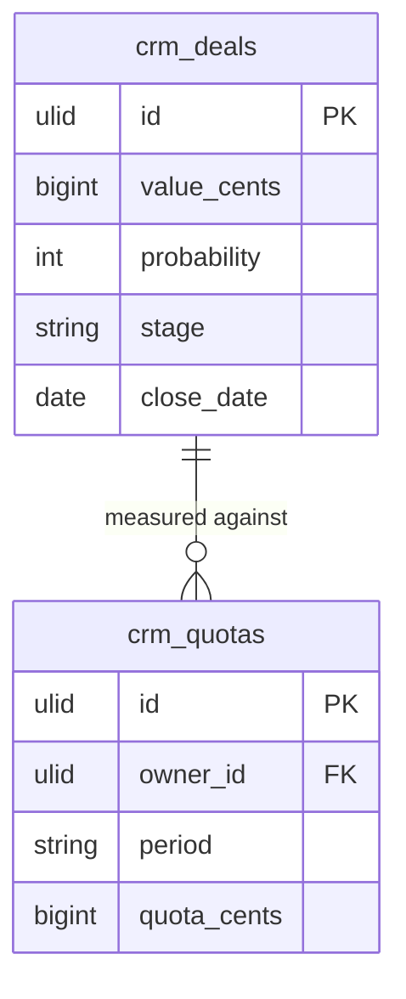

# Feature — Weighted Pipeline

## Purpose

Estimate expected revenue from open deals by discounting each deal's value by its stage probability, then compare against quota via a coverage ratio.

## Flow

1. `SalesForecastService::forecast(period, ?ownerId)` loads open deals from [[../../deals/_module|Deals]] closing within `period`.
2. For each deal: `weighted = value_cents × (probability / 100)` using `brick/money`.
3. `weighted_pipeline_cents` = Σ of all weighted deal values.
4. `coverage_ratio` = `weighted_pipeline_cents / quota_cents` for the owner.
5. When `ownerId` is null, results roll up rep → team → company.

## Rules

- Only open deals are included; closed-won lands in `closed_cents` instead.
- Probability comes from deal stage (source of truth in Deals).
- All arithmetic uses integer minor units via `brick/money` — never raw float math.

## Data Touched

- Owns / writes: `crm_quotas`, `crm_forecast_snapshots` (weekly snapshots).
- Reads: `crm_deals` (value, probability, stage, close date) and `crm_pipeline_stages` (stage probability) — read-only.
- Cross-domain writes: via events only ([[../../../../security/data-ownership]]).

## UI
- **Kind**: widget — the coverage/summary widget on the Forecast dashboard page (`ForecastWidget`, leandrocfe/filament-apex-charts).
- **Page**: `ForecastWidget` on `ForecastPage` (CRM panel, Forecasting nav group), route `/crm/forecast`.
- **Layout**: summary cards / chart — weighted pipeline total, quota, coverage ratio; rep→team→company roll-up when no owner filter.
- **Key interactions**: filter by period and owner/team; hover chart segments for weighted values.
- **States**: empty (no open deals in period) · loading (skeleton while aggregating) · error (missing quota → coverage n/a) · selected (period/owner filter applied)
- **Gating**: `crm.forecasting.view`; `view-own` vs `view-team` scoping enforced on the roll-up.

## Relations
- Consumes: reads `crm_deals` + `crm_pipeline_stages` from [[../../deals/_module|crm.deals]] / [[../../pipeline/_module|crm.pipeline]]; consumes `DealWon`/`DealLost` to refresh cached projections *(assumed — only if a cached projection is kept; otherwise pure read)*.
- Feeds: nothing cross-domain — sales forecast is a read/aggregate input into [[../../../finance/forecasting/_module|finance.forecasting]] via a read API, not an event.
- Shared entity: `crm_deals`, `crm_pipeline_stages` (owned elsewhere), read-only.

## Test Checklist

### Unit
- [ ] `weighted = value_cents × (probability / 100)` computed via brick/money (integer minor units, no float math)
- [ ] `coverage_ratio = weighted_pipeline_cents / quota_cents`; missing quota → coverage n/a (no divide-by-zero)

### Feature (Pest)
- [ ] `SalesForecastService::forecast(period, ownerId)` sums only open deals closing within `period`; closed-won lands in `closed_cents`
- [ ] Null `ownerId` rolls up rep → team → company correctly
- [ ] `view-own` restricts to `owner_id = auth id`; `view-team` widens to the manager's team — no cross-tenant deals included

### Livewire
- [ ] `ForecastWidget` renders weighted pipeline, quota, coverage; period/owner filter re-aggregates
- [ ] Widget hidden without `crm.forecasting.view-any` + active module
