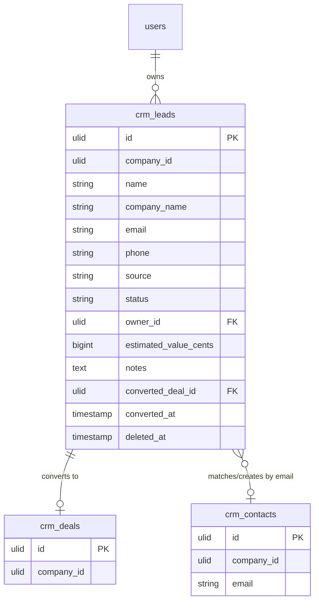

# Leads — Data Model

> Source spec described the data model as prose, not a table; it has been normalised into the table below. See [[unknowns]].

## `crm_leads`

| Column | Type | Notes |
|---|---|---|
| `id` | ulid | PK |
| `company_id` | ulid | Indexed, `BelongsToCompany` |
| `name` | string | Lead / person name |
| `company_name` | string | Prospect company |
| `email` | string | Used for contact matching on convert |
| `phone` | string | E.164 via `propaganistas/laravel-phone` (decision 2026-07-03). |
| `source` | string | manual / website / referral / event / import |
| `status` | string | new / working / qualified / converted / unqualified |
| `owner_id` | ulid | FK → `users` |
| `estimated_value_cents` | bigint | Minor currency unit |
| `notes` | text | |
| `converted_deal_id` | ulid nullable | FK → `crm_deals` |
| `converted_at` | timestamp nullable | Set on convert |
| `created_at` / `updated_at` | timestamps | |
| `deleted_at` | timestamp nullable | `SoftDeletes` |

**Indexes:** `(company_id, status)`.

## ERD

> **PII decision (2026-07-03):** lead `email`/`phone` stay **plaintext** (matching `crm.contacts` — search/dedupe need them queryable); covered by the CRM retention rules in [[../../../architecture/data-lifecycle]]. Phone always normalized to E.164 on the DTO.
