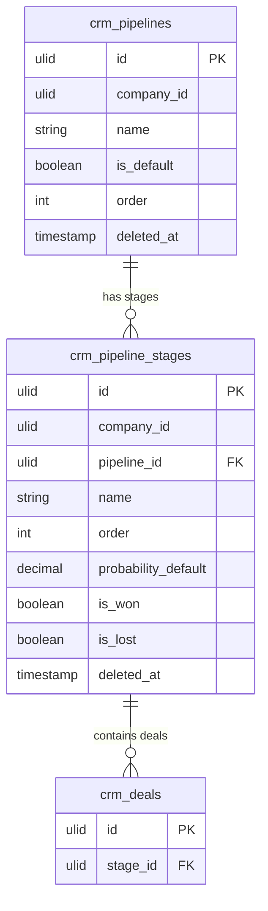

# Pipeline — Data Model

Tables owned: `crm_pipelines`, `crm_pipeline_stages`.

---

## crm_pipelines

*(added 2026-06-12 — [[../decisions|ADR custom pipelines]])*

| Column | Type | Constraints | Notes |
|---|---|---|---|
| id, company_id (indexed) | ulid | | |
| name | string | not null | e.g. "Sales pipeline", "Partnerships" |
| is_default | boolean | default false | opens first on the board |
| order | int | default 0 | switcher order |
| deleted_at | timestamp | nullable | pipeline with active stages cannot be deleted |

---

## crm_pipeline_stages

| Column | Type | Constraints | Notes |
|---|---|---|---|
| id, company_id (indexed) | ulid | | |
| pipeline_id | ulid | FK crm_pipelines, cascade | added 2026-06-12; backfilled to default pipeline |
| name | string | not null | unique `(company_id, name)` |
| order | int | not null | board column order |
| probability_default | decimal(5,2) | not null | applied on stage entry |
| is_won / is_lost | boolean | default false | exactly one of each per company *(assumed)* |
| deleted_at | timestamp | nullable | stage with deals cannot be deleted — reassign first |

Default stages planned to seed on module activation: Lead → Qualified → Proposal → Won / Lost *(assumed)*.

---

## ERD

---

## DTOs

### CreateStageData
- `name` — required, unique per company
- `order` — int
- `probability_default` — 0–100
- `is_won` / `is_lost` — boolean

### MoveDealData
- `deal_id` — ulid in company
- `stage_id` — ulid in company
- Delegates to `DealService::moveToStage`

### BoardFilterData
- `owner_id?`, `account_id?`, `date_from?`, `date_to?`, `value_min?`, `value_max?`, `tag?`

### BoardData (output)
- Stages with ordered deal cards; weighted totals per stage via brick/money
