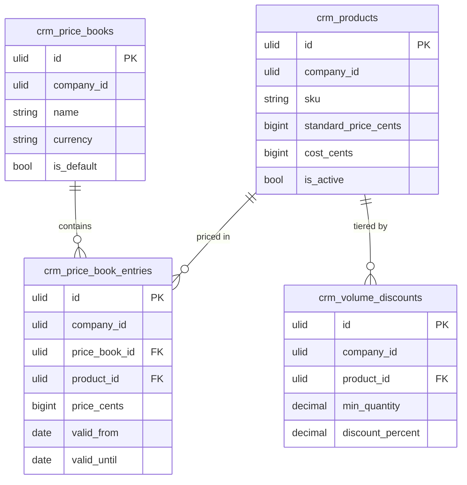

# Price Management — Data Model

Owns `crm_products`, `crm_price_books`, `crm_price_book_entries`, and `crm_volume_discounts`.

## crm_products

| Column | Type | Notes |
|---|---|---|
| id | ulid | PK |
| company_id | ulid | Indexed, tenant scope |
| name | string | |
| sku | string | Unique per company |
| description | text nullable | |
| unit | string | piece / hour / month etc. |
| standard_price_cents | bigint | Minor unit |
| cost_cents | bigint | Minor unit; margin guard basis |
| is_active | bool | Default true |
| deleted_at | timestamp nullable | Soft delete |

**Indexes:** `company_id`; unique `(company_id, sku)`.

## crm_price_books

| Column | Type | Notes |
|---|---|---|
| id | ulid | PK |
| company_id | ulid | Indexed, tenant scope |
| name | string | Unique per company |
| currency | string(3) | ISO currency |
| is_default | bool | Exactly one default per company |
| deleted_at | timestamp nullable | Soft delete |

**Indexes:** `company_id`; unique `(company_id, name)`; partial unique on `(company_id, is_default)` where true *(assumed enforcement)*.

## crm_price_book_entries

| Column | Type | Notes |
|---|---|---|
| id | ulid | PK |
| company_id | ulid | Indexed, tenant scope |
| price_book_id | FK | |
| product_id | FK | |
| price_cents | bigint | Minor unit |
| valid_from | date nullable | Promo window start |
| valid_until | date nullable | Promo window end |

**Indexes:** `company_id`; unique `(price_book_id, product_id, valid_from)`.

## crm_volume_discounts

| Column | Type | Notes |
|---|---|---|
| id | ulid | PK |
| company_id | ulid | Indexed, tenant scope |
| product_id | FK | |
| min_quantity | decimal(10,2) | Tier threshold |
| discount_percent | decimal(5,2) | |

**Indexes:** `company_id`; unique `(product_id, min_quantity)`.

## ER Diagram

