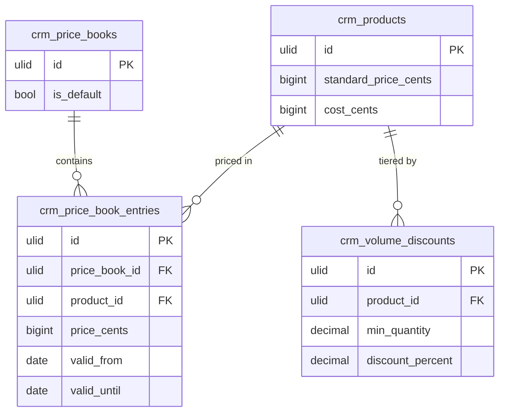

# Feature — CPQ Price Resolution

## Purpose

Given a product, an optional account, a quantity, and a date, resolve the correct unit price for a quote or deal line — applying the right price book, volume tier, and a margin warning.

## Flow

1. Caller (Quote builder or Deal line) submits `ResolvePriceData` (product_id, account_id?, quantity, date?).
2. `PricingService::resolve()` picks the base price by precedence: account's book → segment book → default book → product standard price.
3. Within the chosen book, only entries whose `valid_from`/`valid_until` window contains `date` are eligible *(assumed)*.
4. The highest qualifying volume tier for `quantity` applies its `discount_percent`.
5. The result is margin-checked against `cost_cents` + threshold; `below_margin_warning` is set when the discounted price falls below.
6. Returns `PriceResolutionData` (price_cents, source_book, volume_discount_applied, below_margin_warning).

## Rules

- All monetary math uses integer minor units via `brick/money`.
- Resolution is deterministic; account assignment always beats segment/default.
- The margin warning is advisory — it does not block the price.

## Data Touched

- Owns / writes: nothing — CPQ resolution is a pure read/compute over `crm_products`, `crm_price_books`, `crm_price_book_entries`, `crm_volume_discounts` (all owned by this module); it returns a DTO and writes no rows.
- Reads: own price tables (above); optionally the account's segment (`crm_segments`, owned elsewhere) to pick a book — read-only.
- Cross-domain writes: via events only ([[../../../../security/data-ownership]]).

## UI
- **Kind**: background / service — `PricingService::resolve()` is invoked during quoting; no standalone page. It surfaces inside the quote/deal line-item editor.
- **Page**: none of its own; result renders as the unit price + volume/margin badges on the Quote builder line and Deal line editor.
- **Layout**: n/a (service). In the line-item editor: resolved unit price field, "volume discount applied" hint, and a `below_margin_warning` advisory flag.
- **Key interactions**: line-item editor submits (product, account?, quantity, date) → resolved price flows back; margin warning is advisory, non-blocking.
- **States**: empty (no product selected — standard price) · loading (resolving) · error (no eligible price entry) · selected (resolved price with source book shown)
- **Gating**: invoked under the caller's context — `crm.quotes.update` (quote builder) or `crm.deals.update` (deal line); no separate CPQ permission.

## Relations
- Consumes: nothing cross-domain — provides a read/resolve API.
- Feeds: read API consumed by [[../../quotes/_module|crm.quotes]] and [[../../deals/_module|crm.deals]] for line-item pricing (Feeds via read API, not events).
- Shared entity: `crm_segments` (owned by [[../../segments/_module|crm.segments]]) read-only for book selection *(assumed)*.

## Test Checklist

### Unit
- [ ] Resolution precedence: account book > segment book > default book > product standard price (first match wins)
- [ ] Only entries whose `valid_from`/`valid_until` window contains `date` are eligible
- [ ] `below_margin_warning` set when discounted price < `cost_cents` + threshold; advisory, non-blocking
- [ ] All arithmetic via brick/money integer minor units (no float)

### Feature (Pest)
- [ ] `PricingService::resolve` returns correct `PriceResolutionData` for account/segment/default/standard fixtures
- [ ] Resolution reads only within the acting tenant (no cross-company book leak)
- [ ] Missing eligible entry surfaces the no-price error path
