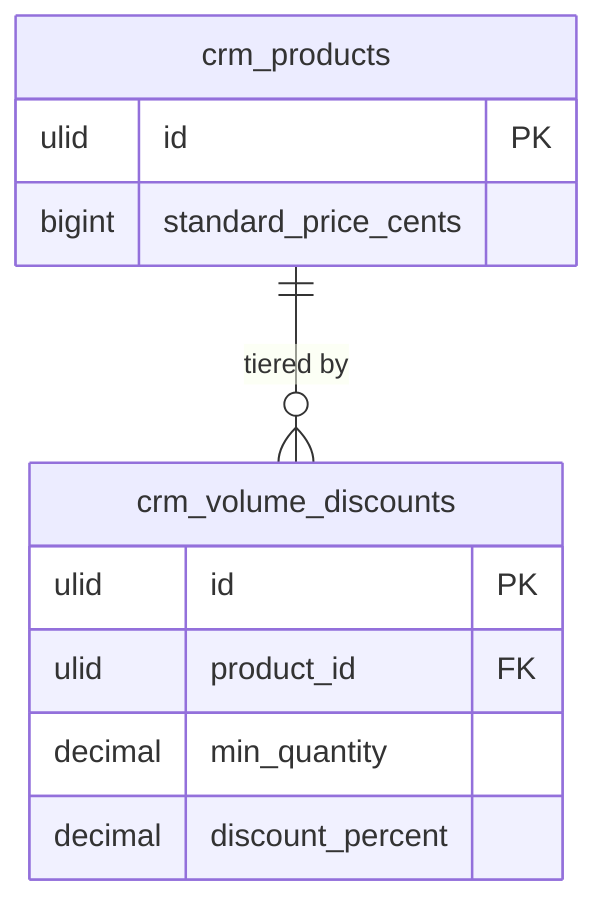

# Feature — Volume Discounts

## Purpose

Apply tiered percentage discounts based on the quantity ordered, so larger orders automatically receive a better unit price.

## Flow

1. A product carries one or more `crm_volume_discounts` rows, each a `(min_quantity, discount_percent)` tier.
2. During `PricingService::resolve()`, the requested `quantity` is matched against the tiers.
3. The highest qualifying tier — the largest `min_quantity` that is `<= quantity` — is chosen.
4. Its `discount_percent` is applied to the resolved base price (after book/promo resolution).
5. The applied percent surfaces in `PriceResolutionData.volume_discount_applied`.

## Rules

- Tiers are unique per `(product_id, min_quantity)`.
- Only one tier applies — the highest qualifying one, not a cumulative stack.
- The tier discount composes after price-book/promo resolution and feeds the margin check.

## Data Touched

- Owns / writes: `crm_volume_discounts` (tier rows), keyed to `crm_products` (also owned by this module).
- Reads: `crm_products` (self) for the base price the tier discount composes against.
- Cross-domain writes: via events only ([[../../../../security/data-ownership]]).

## UI
- **Kind**: simple-resource — a discount-tiers table (managed as a relation of the product).
- **Page**: volume-discounts relation manager on `ProductResource`; route under `/crm/products/{product}` (CRM panel).
- **Layout**: table of `(min_quantity, discount_percent)` tiers per product, sorted by `min_quantity`; add/edit/delete rows.
- **Key interactions**: add a tier; edit percent/threshold; unique `(product_id, min_quantity)` enforced; only the highest qualifying tier applies at resolution.
- **States**: empty (no tiers — flat pricing) · loading (save) · error (duplicate `min_quantity`) · selected (tier row editing)
- **Gating**: `crm.pricing.update` to manage tiers; `crm.pricing.view` to view.

## Relations
- Consumes: nothing cross-domain.
- Feeds: tiers are read by `PricingService::resolve()` (same module) and thus surface to [[../../quotes/_module|crm.quotes]] / [[../../deals/_module|crm.deals]] via the pricing read API — not events.
- Shared entity: none — tiers reference only own `crm_products`.
