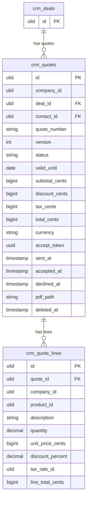

# Quotes — Data Model

Tables owned: `crm_quotes`, `crm_quote_lines`.

---

## crm_quotes

| Column | Type | Constraints | Notes |
|---|---|---|---|
| id, company_id (indexed) | ulid | | |
| deal_id | ulid | not null FK | |
| contact_id | ulid | nullable FK | recipient |
| quote_number | string | unique `(company_id, quote_number)` | Q-2026-001, assigned at send |
| version | int | default 1 | unique `(deal_id, quote_number base, version)` *(assumed)* |
| status | string | default `draft` | state machine |
| valid_until | date | default issue + 30d | |
| subtotal_cents / discount_cents / tax_cents / total_cents | bigint | computed | |
| currency | string(3) | | |
| accept_token | uuid | unique | public accept link |
| sent_at / accepted_at / declined_at | timestamp nullable | | |
| pdf_path | string nullable | | |
| deleted_at | timestamp nullable | | |

---

## crm_quote_lines

| Column | Type | Notes |
|---|---|---|
| id, quote_id FK, company_id | ulid | |
| product_id | ulid nullable | crm.pricing |
| description | string | |
| quantity | decimal(10,2) | min 0.01 |
| unit_price_cents | bigint | |
| discount_percent | decimal(5,2) | 0–100 |
| tax_rate_id | ulid nullable | |
| line_total_cents | bigint | computed |

---

## ERD

