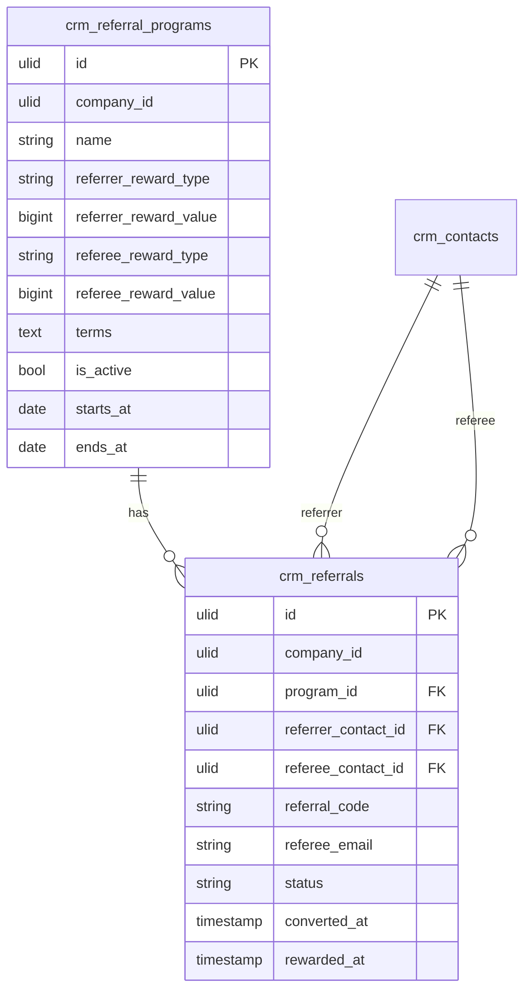

# Referral Program — Data Model

## crm_referral_programs

| Column | Type | Notes |
|---|---|---|
| id | ulid | PK. |
| company_id | ulid | Indexed, tenant scope. |
| name | string | |
| referrer_reward_type | string | `cash` / `credit` / `percent` (decision 2026-07-03 — split from jsonb). |
| referrer_reward_value | bigint | Minor-unit cents for cash/credit (brick/money); basis points for percent. |
| referrer_reward_note | string | Nullable. |
| referee_reward_type | string | `cash` / `credit` / `percent`. |
| referee_reward_value | bigint | Minor-unit cents for cash/credit (brick/money); basis points for percent. |
| referee_reward_note | string | Nullable. |
| terms | text | |
| is_active | bool | |
| starts_at | date | Nullable. |
| ends_at | date | Nullable. |
| deleted_at | timestamp | Nullable, soft delete. |

## crm_referrals

| Column | Type | Notes |
|---|---|---|
| id | ulid | PK. |
| company_id | ulid | Indexed, tenant scope. |
| program_id | ulid | FK → `crm_referral_programs`. |
| referrer_contact_id | ulid | FK → `crm_contacts`. |
| referral_code | string | Unique `(company_id, referral_code)`. |
| referee_email | string | Unique `(program_id, referee_email)` — duplicate guard. |
| referee_contact_id | ulid | Nullable, FK → `crm_contacts` (linked on signup). |
| status | string | Default `pending` (pending / qualified / rewarded / rejected). |
| converted_at | timestamp | Nullable. |
| rewarded_at | timestamp | Nullable. |

## ERD

