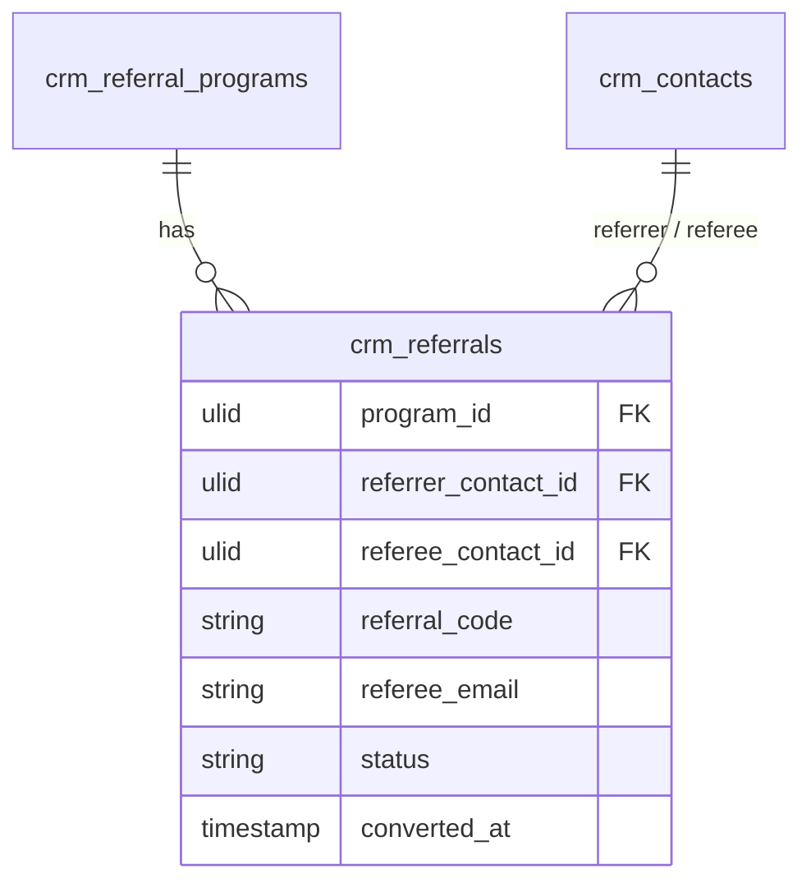

# Feature — Referral Tracking

Issues a unique code per referrer and tracks a referee from capture through conversion, with fraud guards at registration.

## Flow

1. `ReferralService::codeFor(contactId, programId)` generates-or-returns the referrer's unique `referral_code` (unique per `company_id`).
2. A referee arrives via the referral link and submits their email (public capture route — *(assumed)*, currently under-specified).
3. `ReferralService::register(RegisterReferralData)` runs fraud checks:
   - self-referral rejected (referee email or contact matches the referrer),
   - duplicate referee per program rejected (`unique(program_id, referee_email)`),
   - code must belong to an active program (within `starts_at` / `ends_at`).
4. A `crm_referrals` row is created in `pending`, linked to the referrer contact and (on signup) the referee contact.
5. On a qualifying conversion (referee deal won *(assumed)*), `qualify(referralId)` moves it to `qualified` and stamps `converted_at`.

## Data

- Owns / writes: `crm_referral_programs`, `crm_referrals`
- Reads: `crm_contacts` (referrer/referee link); `crm_deals` for qualifying conversion signal *(assumed)* — read-only
- Cross-domain writes: via events only ([[../../../../security/data-ownership]])

## UI
- **Kind**: simple-resource (referrals list) + public-vue capture route
- **Page**: `ReferralResource` within `/crm`; public capture route *(assumed — currently under-specified, see [[../unknowns]])*
- **Layout**: referrals table (status, referrer, referee, code, converted); public capture is a lightweight email-submit page
- **Key interactions**: staff view/filter referrals; referee submits email on the capture route (fraud checks at register)
- **States**: empty (no referrals) · loading (list fetch) · error (self-referral / duplicate / inactive-program rejection) · selected (referral detail)
- **Gating**: `crm.referrals` for the resource; public capture route unauthenticated (rate-limited) *(assumed)*

## Relations
- Consumes: `DealWon` (referee deal won *(assumed)*) → `qualify()` moves referral to `qualified`
- Feeds: `ReferralQualified` → consumed by reward-fulfilment (same-module) / notifications
- Shared entity: `crm_contacts` (owned by Contacts)

## Test Checklist

### Unit
- [ ] `codeFor` returns a stable unique code per (contact, program), unique per company
- [ ] Self-referral (referee email/contact matches referrer) rejected; duplicate `(program_id, referee_email)` rejected

### Feature (Pest)
- [ ] Register only succeeds within an active program window (`starts_at`/`ends_at`)
- [ ] Qualifying conversion moves `pending → qualified` and stamps `converted_at`
- [ ] Tenant isolation: registration resolves company from the code, never an app guard

### Livewire
- [ ] `ReferralResource` list filters by status; row → detail; gated on `crm.referrals.view-any`

## Notes

- Registration only succeeds within an active program window.
- The public capture route is a documented gap — see [[../unknowns]].
