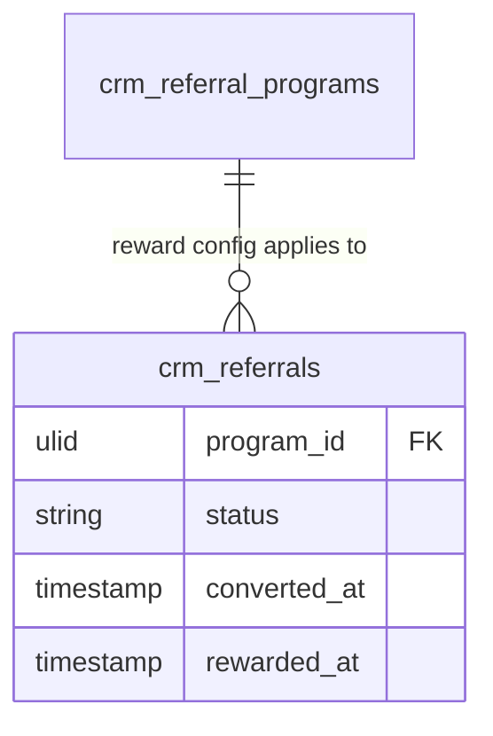

# Feature — Reward Fulfilment

Turns a qualified referral into a fulfilled reward — manual in v1, with a leaderboard for gamification.

## Flow

1. When a referral is qualified, `qualify(referralId)` notifies the fulfilment owner (core.notifications).
2. The owner issues the configured reward (`referrer_reward` / `referee_reward` — discount, credit, cash, or gift). v1 fulfilment is manual *(assumed)*.
3. `markRewarded(referralId)` moves the referral to `rewarded` and stamps `rewarded_at`.
4. `leaderboard(programId)` ranks top referrers — counting qualified + rewarded referrals only *(assumed)*, surfaced on `ReferralLeaderboardPage`.

## Reward config

Programs store `referrer_reward` and `referee_reward` as jsonb: `{type in: discount,credit,cash,gift, value}`.

## Data

- Owns / writes: `crm_referrals` (`status`, `rewarded_at`), `crm_referral_programs` (reward config)
- Reads: `crm_contacts` (reward recipient) — read-only
- Cross-domain writes: via events only ([[../../../../security/data-ownership]]) — any credit/payout to finance goes via event, never a direct finance-table write

## UI
- **Kind**: background (reward issuance on qualification; status surfaces on the referral resource + leaderboard page)
- **Page**: fulfilment status on `ReferralResource` + `ReferralLeaderboardPage` within `/crm`; issuance runs off the qualify event
- **Layout**: reward-status column on the referrals table; leaderboard ranks top referrers
- **Key interactions**: owner issues reward (manual in v1 *(assumed)*), `markRewarded()` stamps `rewarded_at`; view leaderboard
- **States**: empty (no qualified referrals) · loading (leaderboard fetch) · error (fulfilment/notification failure) · selected (referral reward detail)
- **Gating**: `crm.referrals`

## Relations
- Consumes: `ReferralQualified` (from referral-tracking) → notify fulfilment owner, enable issuance
- Feeds: `ReferralRewarded` / reward events; may Feed finance (credit/payout) *(assumed)* and promotions (discount code, P3)
- Shared entity: `crm_contacts` (owned by Contacts)

## Test Checklist

### Unit
- [ ] `leaderboard(programId)` ranks referrers counting qualified + rewarded only *(assumed)*
- [ ] Reward config parses `{type in discount|credit|cash|gift, value}` from jsonb

### Feature (Pest)
- [ ] `qualify` notifies the fulfilment owner (core.notifications) once
- [ ] `markRewarded` moves `qualified → rewarded` and stamps `rewarded_at` exactly once (concurrent double-reward rejected via row lock)
- [ ] Credit/payout to finance goes via event, never a direct finance-table write

### Livewire
- [ ] Mark-rewarded action on `ReferralResource` stamps the reward; requires `crm.referrals.reward`; denied without it

## Notes

- Single reward per referral (`rewarded_at` stamped once).
- Automated fulfilment via [[../../ecommerce/promotions/_module|Promotions]] / Finance is a later enhancement *(assumed)*.
