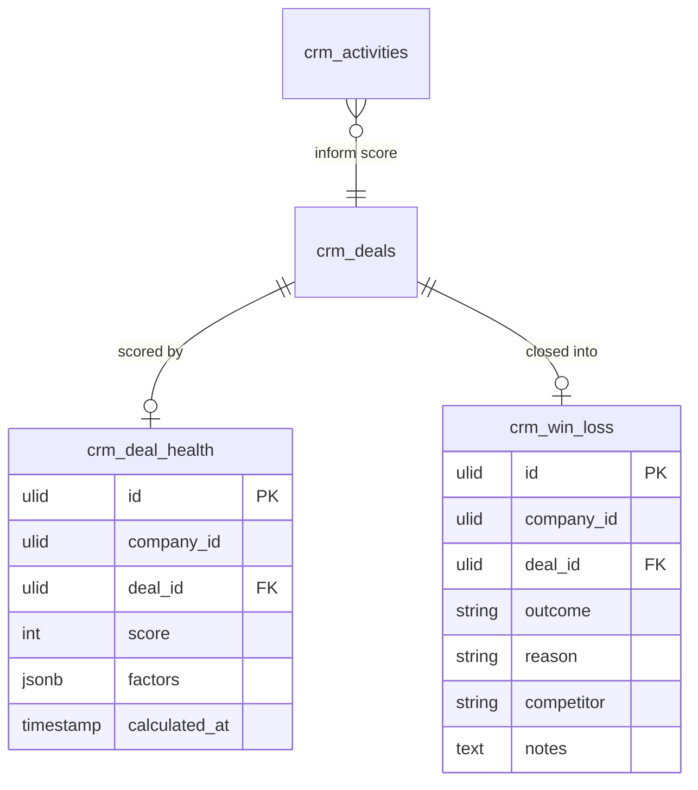

# Revenue Intelligence — Data Model

## crm_deal_health

| Column | Type | Notes |
|---|---|---|
| id | ulid | PK. |
| company_id | ulid | Indexed, tenant scope. |
| deal_id | ulid | FK, unique — one row per open deal. |
| score | int | 0–100. |
| factors | jsonb | `[{factor, score, weight, detail}]` for explainability. |
| calculated_at | timestamp | |

## crm_win_loss

| Column | Type | Notes |
|---|---|---|
| id | ulid | PK. |
| company_id | ulid | Indexed, tenant scope. |
| deal_id | ulid | FK, unique. |
| outcome | string | won / lost. |
| reason | string | From the deal close flow. |
| competitor | string | Nullable. |
| notes | text | Nullable. |

This module also **reads** `crm_deals` and `crm_activities` as scoring / analysis inputs but does not own them.

## ERD

