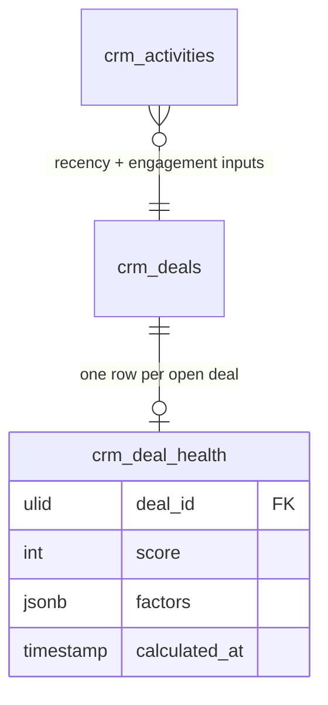

# Feature — Deal Health Scoring

Assigns each open deal a 0–100 health score from weighted, explainable factors, and surfaces an at-risk queue.

## Factors

| Factor | Default weight | Signal |
|---|---|---|
| Activity recency | 30 *(assumed)* | How recently the deal saw activity. |
| Stage velocity vs average | 30 *(assumed)* | Speed through stages vs the norm. |
| Engagement | 20 *(assumed)* | Contact / stakeholder engagement. |
| Deal age vs cycle norm | 20 *(assumed)* | Age relative to typical cycle length. |

## Flow

1. `RecalculateDealHealthCommand` runs nightly (04:15).
2. `DealHealthService::recalculate()` iterates open deals with per-deal try/catch — one deal's failure never stops the batch.
3. Each deal's factors are computed and stored in `factors` jsonb (`[{factor, score, weight, detail}]`) for explainability; a rolled-up `score` is upserted.
4. `DealHealthService::atRisk(threshold=40)` returns deals below the threshold; the `DealHealthResource` shows them as an at-risk queue sorted by score.

## Data

- Owns / writes: `crm_deal_health` (own score/factor table keyed by `deal_id`)
- Reads: `crm_deals` (stage/age/close date), `crm_activities` (recency + engagement) — read-only
- Cross-domain writes: via events only ([[../../../../security/data-ownership]]) — never writes onto `crm_deals`; health is stored in its own table keyed by `deal_id`

## UI
- **Kind**: widget (health-score chip/widget on deals, fed by a scheduled scoring job)
- **Page**: health-score widget on the deal view + at-risk queue on `DealHealthResource` within `/crm`; scoring runs as a nightly background job (`RecalculateDealHealthCommand`, 04:15)
- **Layout**: score chip (0–100) + factor breakdown popover; at-risk list sorted by score
- **Key interactions**: view score + explainable factors; open at-risk queue; manual recalc (admin)
- **States**: empty (deal not yet scored) · loading (recalc running) · error (per-deal failure isolated, batch continues) · selected (factor drill-down)
- **Gating**: `crm.revenue-intelligence`

## Relations
- Consumes: `ActivityLogged`, `EmailTracked`, `DealRoomViewed` (engagement signals) → recalculated into score
- Feeds: `DealHealthChanged` *(assumed)* → consumed by sequences / notifications
- Shared entity: `crm_deals` (owned by Deals — read-only here)

## Test Checklist

### Unit
- [ ] Weighted factor math (30/30/20/20 *(assumed)*) yields the exact 0–100 score over fixture deals
- [ ] Deal with no activity for 14 days *(assumed)* scores low and flags at-risk (`score < 40`)

### Feature (Pest)
- [ ] `recalculate()` upserts one health row per open deal; a per-deal failure doesn't stop the batch
- [ ] Recalc is idempotent — re-run yields identical scores/rows
- [ ] Never writes `crm_deals`; health stored only in `crm_deal_health` keyed by `deal_id`

### Livewire
- [ ] Health-score chip + factor popover render on the deal view; gated on `crm.revenue-intelligence.view-any`

## Notes

- Scoring is deterministic — the test suite asserts exact factor math over fixture deals.
- A deal with no activity for 14 days *(assumed)* scores low and appears at-risk.
