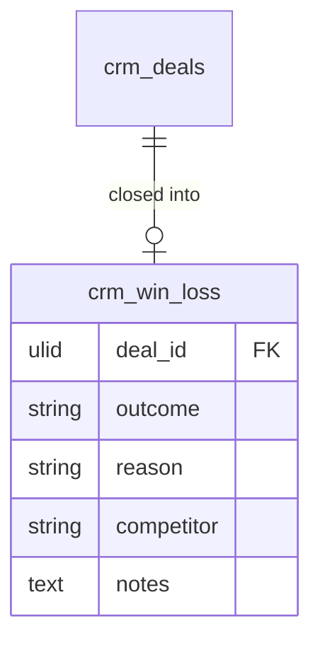

# Feature — Win/Loss Analysis

Captures why deals close won or lost and surfaces patterns — reasons, competitors, conversion funnel, and velocity.

## Capture

When a deal closes, CRM's own `DealService` close path makes a **direct service call** (same-domain, not an event) to write a `crm_win_loss` row carrying `outcome` (won/lost), `reason`, optional `competitor`, and `notes`.

## Analysis

`WinLossService::analysis(from, to)` returns a `WinLossAnalysisData` with:

- reason breakdown (by count),
- competitor win/loss table,
- stage-to-stage conversion funnel,
- velocity stats (avg time per stage, cycle length).

Results are cached per date range at `company:{id}:crm:winloss:{from}:{to}` (TTL 1h).

## Surfaces

- `WinLossPage` (Intelligence nav group) — apex charts for reasons, competitors, funnel.
- `RevenueIntelligenceDashboard` — velocity, conversion, health distribution.

## Data

- Owns / writes: `crm_win_loss` (outcome/reason/competitor/notes rows keyed by `deal_id`)
- Reads: `crm_deals` (stages, close dates for funnel/velocity), `crm_activities` (correlation) — read-only
- Cross-domain writes: via events only ([[../../../../security/data-ownership]]) — the `crm_win_loss` row is written by *this* module (populated from Deals' close path, same-domain service call), never a write onto `crm_deals`

## UI
- **Kind**: custom-page + widgets (analytics dashboard with charts, filament-apex-charts)
- **Page**: `WinLossPage` (Intelligence nav group) + `RevenueIntelligenceDashboard` within `/crm`
- **Layout**: apex charts — reason breakdown, competitor win/loss table, stage conversion funnel, velocity stats
- **Key interactions**: date-range filter; drill into reason / competitor; results cached per range (TTL 1h)
- **States**: empty (no closed deals in range) · loading (query / cache miss) · error (query failure) · selected (drilled reason/competitor segment)
- **Gating**: `crm.revenue-intelligence`

## Relations
- Consumes: `DealWon` / `DealLost` (close outcomes) → win/loss row + analysis refresh
- Feeds: analysis surfaced on dashboard; no outbound cross-domain events
- Shared entity: `crm_deals` (owned by Deals — read-only here)

## Test Checklist

### Unit
- [ ] Conversion-funnel percentages and velocity stats correct over fixtures
- [ ] Reason / competitor breakdown aggregates by count correctly

### Feature (Pest)
- [ ] Deal close writes a `crm_win_loss` row (outcome/reason/competitor/notes) via the same-domain `DealService` call
- [ ] `analysis(from,to)` results cached per range at `company:{id}:crm:winloss:{from}:{to}` (TTL 1h)
- [ ] Tenant isolation: analysis only aggregates the company's own closed deals

### Livewire
- [ ] `WinLossPage` date-range filter updates charts; drill into reason/competitor; gated on `crm.revenue-intelligence.view-any`

## Notes

- LLM summarisation of reasons via [[../../ai/copilot/_module|AI Copilot]] is a P3 soft dependency.
- Conversion funnel percentages are asserted over fixtures in the test suite.
