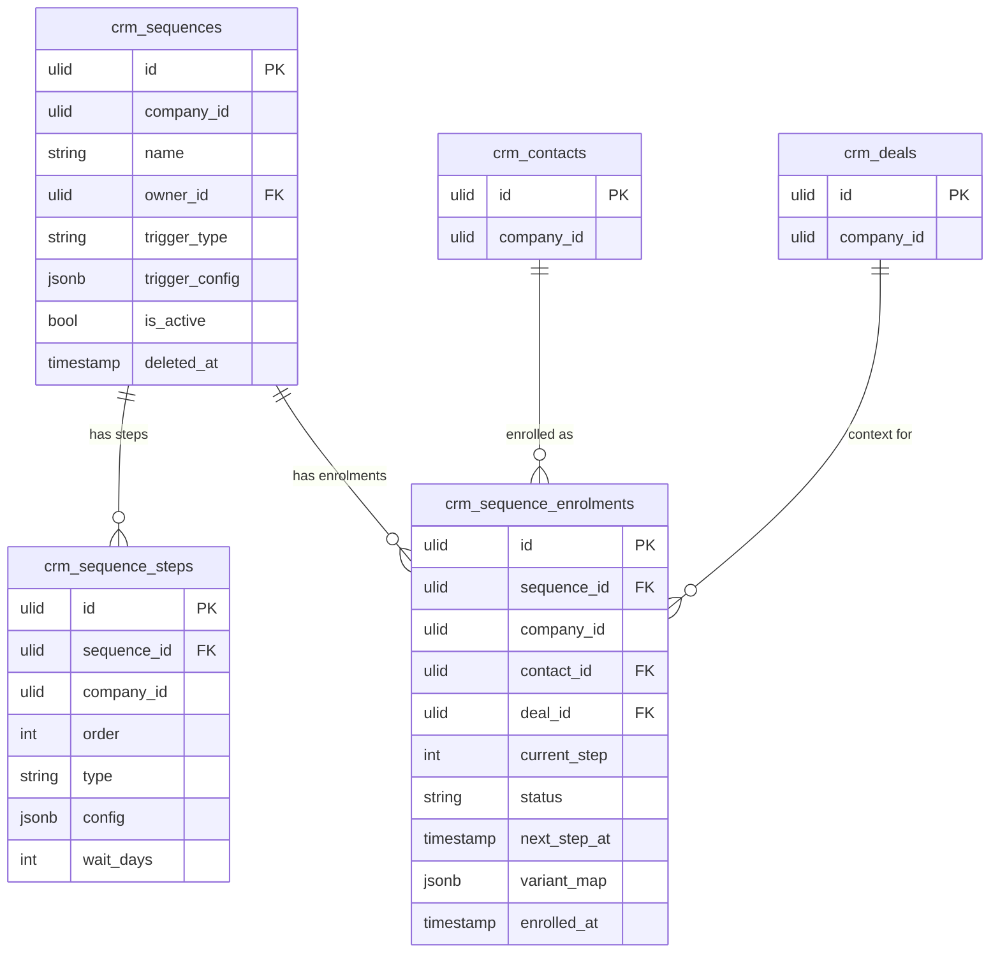

# Sales Sequences — Data Model

## crm_sequences

| Column | Type | Notes |
|---|---|---|
| id | ulid | PK |
| company_id | ulid | Indexed; tenant scope |
| name | string | |
| owner_id | ulid | FK; personal owner (null = team sequence) |
| trigger_type | string | `manual` / `stage-change` / `segment-entry` / `deal-won` / `invoice-paid` |
| trigger_config | jsonb | Nullable; stage id / segment id |
| is_active | bool | |
| deleted_at | timestamp | Nullable (soft delete) |

## crm_sequence_steps

| Column | Type | Notes |
|---|---|---|
| id | ulid | PK |
| sequence_id | ulid | FK → crm_sequences |
| company_id | ulid | Tenant scope |
| order | int | Unique `(sequence_id, order)` |
| type | string | `email` / `call` / `wait` / `task` |
| config | jsonb | Template id(s) / variants, task text |
| wait_days | int | Default 0 |

Indexes: unique `(sequence_id, order)`.

## crm_sequence_enrolments

| Column | Type | Notes |
|---|---|---|
| id | ulid | PK |
| sequence_id | ulid | FK → crm_sequences |
| company_id | ulid | Indexed; tenant scope |
| contact_id | ulid | FK; unique active `(sequence_id, contact_id)` |
| deal_id | ulid | Nullable FK → crm_deals |
| current_step | int | Default 0 |
| status | string | Default `active` (active/paused/completed/unenrolled) |
| next_step_at | timestamp | Advancement cursor |
| variant_map | jsonb | A/B assignments |
| enrolled_at | timestamp | |

Indexes: `(company_id, status, next_step_at)` for the advance query; unique active `(sequence_id, contact_id)`.

## ERD

